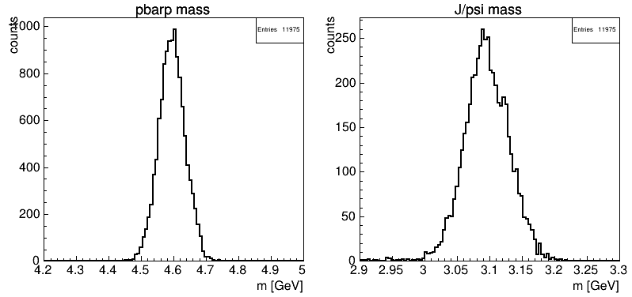

```text
@@@@@@@@@@@@@@@@@@@@@@@@@@@@@@@@@@@@@@@@@@@@@@@@@@@@@@@@@@@@@@@@@@@@@@@@@@@@@@@@@@@@@@@@@@@@@@@@@@@@@@@@@
@                                                                                                       @
@    @@     @@ @@@@@@@@ @@@@@@@@     @@@@@@@@    @@@     @@@@@@  @@@@@@@@     @@@@@@  @@@@ @@     @@    @
@    @@     @@ @@       @@     @@    @@         @@ @@   @@    @@    @@       @@    @@  @@  @@@   @@@    @
@    @@     @@ @@       @@     @@    @@        @@   @@  @@          @@       @@        @@  @@@@ @@@@    @
@    @@@@@@@@@ @@@@@@   @@@@@@@@     @@@@@@   @@     @@  @@@@@@     @@        @@@@@@   @@  @@ @@@ @@    @
@    @@     @@ @@       @@           @@       @@@@@@@@@       @@    @@             @@  @@  @@     @@    @
@    @@     @@ @@       @@           @@       @@     @@ @@    @@    @@       @@    @@  @@  @@     @@    @
@    @@     @@ @@@@@@@@ @@           @@       @@     @@  @@@@@@     @@        @@@@@@  @@@@ @@     @@    @
@                                                                                                       @
@@@@@@@@@@@@@@@@@@@@@@@@@@@@@@@@@@@@@@@@@@@@@@@@@@@@@@@@@@@@@@@@@@@@@@@@@@@@@@@@@@@@@@@@@@@@@@@@@@@@@@@@@

Copyright 2025, Klaus Götzen, GSI Helmholtzzentrum für Schwerionenforschung GmbH
License: Creative Commons Attribution-NonCommercial-ShareAlike 4.0 International (CC BY-NC-SA 4.0)
```

# Table of Contents

* [Introduction](#introduction)
* [Quick Start](#quick-start)
* [General Concept](doc/GeneralConcept.md)
* [Code](doc/Code.md)
* [Getting Started](doc/GettingStarted.md)
* [Configuration Setup](doc/ConfigurationSetup.md)
* [Running on Virgo](doc/Virgo.md)
* [Tools](doc/Tools.md)
* [Demos](doc/Demos.md)
* [Appendix](doc/Appendix.md)
* [References](doc/References.md)

# Introduction

**HepFastSim** is (supposed to be) a simple-to-use, experiment-independent, stand-alone Fast Simulation Framework. Its purpose is the ability to setup a rough detector geometry in a short time (without too much details needed) and test it for various physics cases without the need for an external generator. The focus is on simplicity and speed rather than on accuracy. The general spirit is, that you do _not need_ to provide many details about the detector specification if you do not have them, but you _can_ specify more details if available to improve accuracy.

An online version of the documentation is located at [https://klausgoetzen.github.io/hfsdoc/](https://klausgoetzen.github.io/hfsdoc/).
# Quick Start

Before we start going into details let us run an example simulation. After unpacking you need to source the file `. set_rootinc.sh` in the install directory. This tells ROOT to look for include/source files in the `src/` directory. There are some example configuration files located in the subfolder `cfg/`. The default minimalistic demo is the simulation and reconstruction of the signal decay channel `anti-p p -> J/psi pi+ pi-`. We can run it with (the `+` at the end of the macro name `HepFastSim.C+` compiles the macro when running for the first time, roughly doubling the speed) 

```c++
> root -l 'HepFastSim.C+(10000,"cfg/demo_mini.cfg")'
```



A ROOT canvas with two pads will pop up, showing the invariant masses of the reconstructed `anti-p p` system and the `J/psi` candidates. Per default, the plots will be updated every 1000 events during runtime. 
After the simulation is finished a brief output summary is printed

```
Processing HepFastSim.C+(10000,"cfg/demo_mini.cfg")...
HepFastSim - Copyright (C) 2024 (GPLv3) - Author: Klaus Goetzen (GSI) - Distributed WITHOUT ANY WARRANTY.


Running HepFastSim ... 
Event: 1000 2000 3000 4000 5000 6000 7000 8000 9000 10000 

Number of events         : 10000
CPU time                 : 2.640 s
Speed                    : 3788 Hz
```

Let us take a quick look to the configuration file `cfg/demo_mini.cfg`:

```txt
GEN  ;; phsp : p1=10.3 : reaction=anti-p-,p+ 
GEN  ;; phsp : dec = pbarpSystem -> J/psi pi+ pi- ; J/psi -> mu+ mu-

TRK  ;; name=trk : tht=5,160 : eff=0.95 : dp=1.5 : dtht=2 : dphi=2
PID  ;; name=pid : tht=5,160 : eff=0.95 : mres = 0.2

REC  ;; dec = J/psi -> mu+ mu- ; pbarpSystem -> J/psi pi+ pi- : pidmu(mu+-)=0.1 : store(pbarpSystem, ntp0)=cand

HIST ;; tree=ntp0 : title=\bar{p}p mass;m [GeV] : hist=4.2,5.0 
HIST ;; tree=ntp0 : title=J/psi mass;m [GeV]    : hist=2.9,3.3 : var=xd0m
```

Here we basically see the typical four configuration sections for any simulation analysis: 

* **Event generation** (`GEN`): 
  * A phase-space generator for anti-p p is defined with beam momentum of p(anti-p) = 10.3 GeV/c, p at rest.
  * The decay pattern `anti-p p -> J/psi pi+ pi-` with `J/psi -> mu+ mu-` is defined.
* **Detector configuration** for simulation (`TRK` and `PID`)
  * A tracking detector (name `trk`) with coverage 5° \< theta \< 160° and certain detection efficiency (`eff`) and resolutions (`dp`, `dtht`, `dphi`) is added.
  * A particle identification detector (name `pid`) with the same acceptance/effciency and a relative mass reconstruction resolution (`mres`) of 20% is added.
* **Reconstruction of composites** and storage (`REC`)
  * Reconstruction of the decay chain `anti-p p -> J/psi (-> mu+ mu-) pi+ pi-`
  * Require PID probability `P_mu > 0.1` for `mu+-` (the assignment `pidmu(mu+-)=0.1` is an abbreviation for the range `pidmu(mu+-)=0.1,1.0`)
* **Live histograms** for invariant masses are defined (`HIST`)

In the configuration file each line starts with a capital letter keyword separated by a double semicolon (`;;`), followed by a colon (`:`) separated list of parameter and configuration settings. For this very simple example this is all the user needs to provide to run the simulation. 

Proceed to the next section: [General Concept](doc/GeneralConcept.md)
