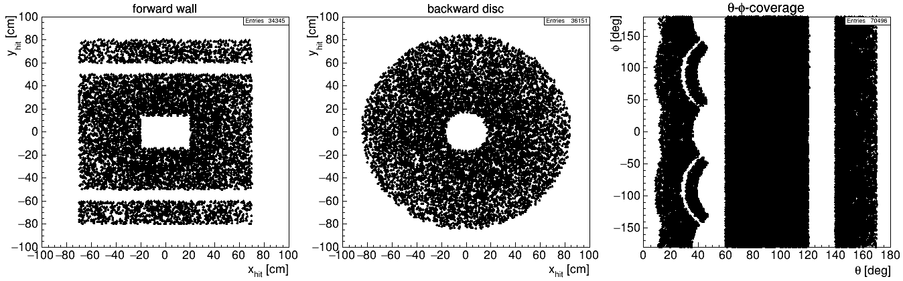
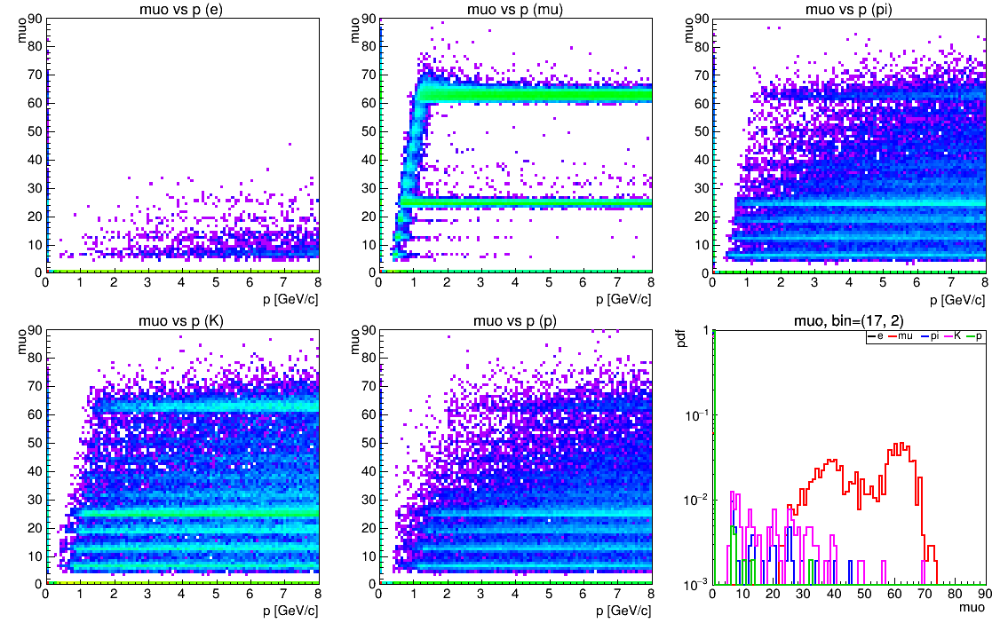
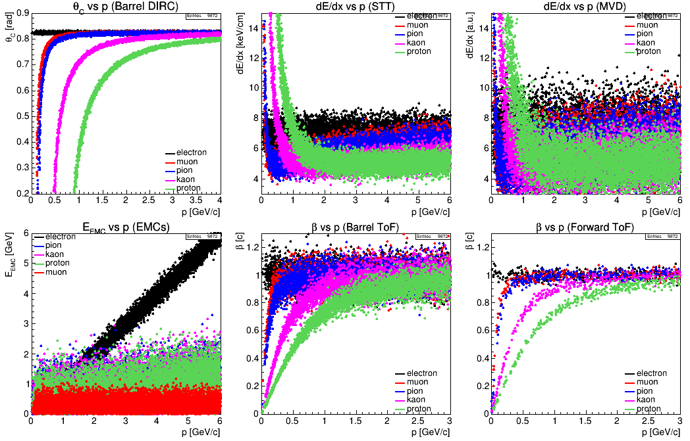

```
@@@@@@@@@@@@@@@@@@@@@@@@@@@@@@@@@@@@@@@@@@@@@@@@@@@@@@@@@@@@@@@@@@@@@@@@@@@@@@@@@@@@@@@@@@@@@@@@@@@@@@@@@
@                                                                                                       @
@    @@     @@ @@@@@@@@ @@@@@@@@     @@@@@@@@    @@@     @@@@@@  @@@@@@@@     @@@@@@  @@@@ @@     @@    @
@    @@     @@ @@       @@     @@    @@         @@ @@   @@    @@    @@       @@    @@  @@  @@@   @@@    @
@    @@     @@ @@       @@     @@    @@        @@   @@  @@          @@       @@        @@  @@@@ @@@@    @
@    @@@@@@@@@ @@@@@@   @@@@@@@@     @@@@@@   @@     @@  @@@@@@     @@        @@@@@@   @@  @@ @@@ @@    @
@    @@     @@ @@       @@           @@       @@@@@@@@@       @@    @@             @@  @@  @@     @@    @
@    @@     @@ @@       @@           @@       @@     @@ @@    @@    @@       @@    @@  @@  @@     @@    @
@    @@     @@ @@@@@@@@ @@           @@       @@     @@  @@@@@@     @@        @@@@@@  @@@@ @@     @@    @
@                                                                                                       @
@@@@@@@@@@@@@@@@@@@@@@@@@@@@@@@@@@@@@@@@@@@@@@@@@@@@@@@@@@@@@@@@@@@@@@@@@@@@@@@@@@@@@@@@@@@@@@@@@@@@@@@@@
```

# Table of Contents

* [Introduction](../README.md)
* [Quick Start](../README.md)
* [General Concept](GeneralConcept.md)
* [Code](Code.md)
* [Getting Started](GettingStarted.md)
* [Configuration Setup](ConfigurationSetup.md)
   + [INC - Include Another Config File](#inc---include-another-config-file)
   + [OPT - General Options](#opt---general-options)
   + [ADD - Particle Database Manipulation](#add---particle-database-manipulation)
   + [GEN - Event Generation/Input](#gen---event-generationinput)
     - [evtreader](#evtreader)
     - [partreader](#partreader)
     - [box](#box)
     - [phsp](#phsp)
   + [Detector Basics](#detector-basics)
     - [Spatial Acceptance](#spatial-acceptance)
     - [Detection Efficiency](#detection-efficiency)
     - [Resolution](#resolution)
   + [TRK - Tracking Detectors](#trk---tracking-detectors)
   + [EMC - Photon Detectors](#emc---photon-detectors)
   + [PID - Particle Identification Detectors](#pid---particle-identification-detectors)
   + [REC - REC - Reconstruction/Analysis](#rec---reconstructionanalysis)
   + [HIST - Live Histograms](#hist---live-histograms)
* [Running on Virgo](Virgo.md)
* [Tools](Tools.md)
* [Demos](Demos.md)
* [Appendix](Appendix.md)

# Configuration Setup

## INC - Include Another Config File
[Back to TOC](#table-of-contents)

This simple statement allows to include configurations from another configuration file. The syntax is
```
INC ;; <file name>
```
If the included file `<file name>` itself contains an `INC` statement, the inclusion will be done recursively. In order to avoid possible infinite include loops, each include file is only added once.

## OPT - General Options
[Back to TOC](#table-of-contents)

General options globally steer the behaviour of HepFastSim. Some options have impact on the simulation itself, others are related to storage options or histogramming.

| Parameter   | Meaning                                                                                            | Default                       |
| ----------- | ---------------------------------------------------------------------------------------------------| ----------------------------- |
| `verbose`   | verbosity level (the higher the more is printed)                                                   | `0`                           |
| `gen`       | name of generator config file                                                                      | global options file           |
| `det`       | name of detector config file                                                                       | global options file           |
| `ana`       | name of analysis config file                                                                       | global options file           |
| `storeopt`  | store options for composites and event shape; veto by prepending `!` to option. Available options: |                               |
|             | `all, cms, 2body, dalitz, pid, micro, truth, pos, fit, mult, max, sum, shape`                      | `all` (store everything)      |
| `pidmode`   | global PID mode: chi2 or lh                                                                        | `chi2`                        |
| `mode`      | arbitrary mode number stored in all TTrees                                                         | `0`                           |
| `tag`       | arbirtary tag (string) appended to output file                                                     | _empty_                       |
| `print`     | cycle (number of events) to update live histos / print event number                                | `1000`                        |
| `errlvl`    | ROOT error level output suppression (number from 0 to 4)                                           | `0` _(no suppression)_        |
| `mcphot`    | number of additional low energetic photons to allow for successful MC truth match                  | `5`                           |
| `mcethresh` | energy threshold for low energetic photons                                                         | `0.03` \[GeV]                 |
| `bzfield`   | field strength of optional solenoid field in z-direction around IP                                 | `0.0` \[T]                    |
| `prop2ip`   | _flag:_ propagate (secondary) tracks to z=0                                                        | `0` _(false)_                 |
| `rndseed`   | random seed (for reproducibility)                                                                  | `0` (= not fixed)             |
| `hconf`     | canvas configuration for live historgrams as _padwidth, columns_                                   | `400,4`                       |
| `nmc`       | _flag:_ generate MC truth TTree                                                                    | `0` _(false)_                 |
| `savenmc`   | _flag:_ save MC truth TTree to output file                                                         | `0` _(false)_                 |
| `savetree`  | _flag:_ save all analysis TTrees to output file                                                    | `1` _(true)_                  |
| `savehist`  | _flag:_ save histograms to output file                                                             | `0` _(false)_                 |
| `savefig`   | name under which to save live histogram canvas                                                     | _none_ (= do not save canvas) |
| `file`      | name of output file                                                                                | `ana_<cfg>_<tag>.root`        |

## ADD - Particle Database Manipulation
[Back to TOC](#table-of-contents)

This keyword allows to perform manipulations of the particle database (`TDatabasePDG`), adding new or cloning existing particles as well as adding decay channels. This feature is useful when simulating unknown (exotic) particles with certain properties. The basic syntax is

```
ADD ;; particle=<name> : <parameter list>
```

where the specification of the parameter `particle` is mandatory for any kind of action. The available parameters are

| Parameter                 | Meaning                                                                                  |
| ------------------------- | ---------------------------------------------------------------------------------------- |
| `particle = <name>`       | Name of the particle. Can be an existing or new name, depending on action _(mandatory)_. |
| `alias = <name>`          | Copy properties (mass, width, charge) from alias particle.                               |
| `mass = <mass>`           | Mass of new particle. Overrides value from alias if both are specified.                  |
| `width = <width>`         | Width of new particle. Overrides value from alias if both are specified.                 |
| `charge = <charge>`       | Charge of new particle. Overrides value from alias, estimated from name if missing.      |
| `pdg = <code>`            | PDG code of new particle. If not given, an automatic code is generated _(optional)_.     |
| `addcc`                   | _Flag._ Adds charged conjugate with adapted name, opposite charge and PDG code.          |
| `decay = <particle list>` | Add a decay channel by specifying daughter list `<particle list>`                        |
| `bf = <fraction>`         | Branching fraction of decay. Default = 1.                                                |

_Examples:_

```
ADD ;; particle=X(4444) : mass=4.444 : width=0.05                # add new neutral particle X(4444)
ADD ;; particle=Z(4000)+ : alias=Z_c(3900)+ : mass=4.0 : addcc   # add new charged particle Z(4000)+ and c.c. Z(4000)- based on existing Z_c(3900)+

ADD ;; particle=myJpsi : alias=J/psi : decay=mu+ mu- : bf=0.5    # add clone of J/psi with decay myJpsi -> mu+ mu- (50%) 
ADD ;; particle=myJpsi : decay=e+ e- : bf=0.5                    # add second decay myJpsi -> e+ e-   (50%)
```

This generates the output (with `verbose=1`)

```
###  INFO    -- [AddParticlePDG] --  Added particle: X(4444)                70000	Mass:   4.4440 Width (GeV): 5.0000e-02	Charge:   0.0
###  INFO    -- [AddParticlePDG] --  Added particle: Z(4000)+               70001	Mass:   4.0000 Width (GeV): 2.8200e-02	Charge:   3.0
###  INFO    -- [AddParticlePDG] --  Added particle: Z(4000)-              -70001	Mass:   4.0000 Width (GeV): 2.8200e-02	Charge:  -3.0
###  INFO    -- [AddParticlePDG] --  Added particle: myJpsi                 70002	Mass:   3.0969 Width (GeV): 9.2900e-05	Charge:   0.0
###  INFO    -- [AddParticlePDG] --  Added decay channel for 'myJpsi':       0     0  5.00000e-01     2     mu+(     -13)   mu-(      13)
###  INFO    -- [AddParticlePDG] --  Added decay channel for 'myJpsi':       1     0  5.00000e-01     2      e+(     -11)    e-(      11) 
```

## GEN - Event Generation/Input
[Back to TOC](#table-of-contents)

There are several ways to generate input event for HepFastSim. The general syntax is

```
GEN ;; <generator keyword> : c = <channel> : f = <fraction> : <parameter list for this event input>
```

where `<generator keyword>` acts as a flag to enable the corresponding event input. There are two settings, which all generators have in common, namely an arbitrary channel number `c` and fraction `f` reflecting the probability to be triggered. The latter is only relevant, if more than one event sources are connected. In that case the sum of all fractions is used as normalization, so that the actual probability is 

$$
P_j = \frac{f_j }{\sum_i(f_i)}.
$$

**In case no fraction is specified, the generator is always active, and the generated tracks are added to the particle list all the time.** This feature can be used to study event mixing or the appearance of additional (fake/ghost/clone) tracks.

The generator keyword is one of the following four:

| Keyword      | Generator description                                                                |
| ------------ | ------------------------------------------------------------------------------------ |
| `evtreader`  | Reader for EvtGen ROOT ouput                                                         |
| `partreader` | Reader for `TClonesArray` of `TParticle` (= output format of DPM and FTF generators) |
| `box`        | Box generator (particle gun)                                                         |
| `phsp`       | Phase-space decayer HepFastPhspGen                                                   |

### evtreader
[Back to TOC](#table-of-contents)

The usage of `evtreader` is very straigh-forward, since there are basically no things to specify except the file name `file`, the tree name `tree` inside the file, the channel number `c` and fraction `f`. The syntax simply looks like this:

```
GEN ;; evtreader : c=1 : f=0.2 : file=ppbar_jpsi2pi.root : tree=ntp
```

If the tree has the default name `ntp`, this default setting can be ommitted.

### partreader
[Back to TOC](#table-of-contents)

The usage of `partreader` is quite similar to that described above. However, since these readers are assumed to be generic/background event inputs, there are a few more options. Firstly, there is the possibility to filter the input by looking for certain particles (not) to appear. Secondly there is a switch to enable channel mapping, which helps to perform background analysis. The options are

* `veto = <list of particle names>`: Only accept events that **do not include** any particle from `<list of particle names>`.
* `trig = <list of particle names>`: Only accept events that **do include** at least one of the particles from `<list of particle names>`.
* `mapbg [= <channel number offset>]`: Can be used as flag. The parameter value `<channel numnber offset>` is optional and represents the integer added to the background channel numbers (numbered in order of appearance) to separate them from signal channels. If not given, the default offset is 1000. It creates a file `bgmap_<num>.txt` containing a list of channel numbers with channels, with `<num>` being the current count of the `partreader` input. The tool `HepFastBgAnalysis.C` can be used to analyse the background.

The options `veto` and `trig` can be applied at the same time. Since any non-stable particle found in the list of generated particles will be decayed according to the decay-list from TDatabasePDG until only finals states (or particles without any decay channels defined) are left, the veto and trigger options are applied to the complete decay chain. 

_Example:_

```
GEN ;; partreader : f=1 : file=ftf_4gev.root : tree=data : veto=K_S0 : trig=Lambda0 cc : mapbg=10000
```

This reads the events from the given source (the default tree-name `tree=data` can be ommitted as well) and only accepts events containing a `Lambda0` or `anti-Lambda0`, but without a `K_S0` in the decay chain. It dumps a background map `bgmap_0.txt` with channel numbers starting at c=10000. 

**One word of caution:** Since events are read from a file and thus are limited, we can run out of events when veto and/or trigger are too selective. So the user should make sure, that the input file has sufficient number of events stored.

### box
[Back to TOC](#table-of-contents)

The box generator acts as a particle gun, which shoots arbitrary particle (without boost) into defined parts of phase space. Parameters that can be specified are

* `p = <p_min>, <p_max>`: Momentum range in units of GeV/c. Default setting is `p=0.1,8.0`.
* `tht = <tht_min>, <tht_max>`: Polar angle theta range in degrees. Default setting is `tht=0,180`.
* `phi = <phi_min>, <phi_max>`: Angle phi range in degrees. Default setting is `phi-180,180`.
* `costht`: _Flag_. If set, distribution is generated uniform in cos(theta) instead of theta.
* `pdg = <list of pdg codes/particle names>`: PDG codes or particle names (can be a mixtures of both) to be generated.
* `mult = <list of multiplicities>`: Possible particle multiplicities for events.

For each event, a multiplicity is uniformly chosen from the list `mult`, and for each particle to be generated, a particle type is selected from the list `pdg`, which gets assigned random properties according to the selected phase space region in `p`, `tht` and `phi`.

_Example:_

```
GEN ;; box : p=1,2 : tht=22,140 : costht : pdg=pi+-, K+-, p+- : mult=0,0,2,4
```

Here, we generated an even number of final state hadrons between 0 and 4 particles, where half of the time no particle is generated (we have two times zero, and two times non-zero multiplicity). Since there is no fraction `f` defined, the generated particles are appended to the list of particles for every event generated from other sources.

### phsp
[Back to TOC](#table-of-contents)

The phase space decayer implemented as the class `HepFastPhspGen` based on ROOTs `TGenPhaseSpace` is the most versatile and powerful but also most complex generator to be configured. It primarily acts as a signal channel generator, but it can also be used for either specific background channels, or in combination with a parametrization file from generic generators (like DPM or FTF), as generic background generator. The latter possibilty probably makes it to the most useful generator since it makes HepFastSim completely independent of any external input even for (rough) background studies.

Using `phsp` basically requires two steps, that are:

1. Setting up the initial system, and then 
2. adding an arbitrary number of decay channels. 

For generic background, a file input with parametrized cross section curves can be used, which formally adds many decay channels at once like under 2.

#### phsp - Setting up initial system

The first thing to do is to setup the initial reaction. This can either be done by defining the center-of-mass energy E_cm, or one or both beam momenta p1 and/or p2. In case of asymmetric reactions the beam and target particles need to be defined as well. Only one configuration line for setting up `phsp` is allowed, any additional lines of that kind are simply ignored by the parser.

##### Center-of-mass - symmetric reaction

This initial system requires the least amount of information. Since in a symmetric reaction the masses of the beam particles are not needed to compute the initial Lorentz-vector, this information does not need to be defined. _Any consequences like e.g. baryon number or angular momentum conservation having impact on the outgoing particles is in the responsibility of the user._ As minimum input only a single number, the center-of-mass energy E_cm, is needed, represented by the parameter `ecm`. What can be given as a second parameter is a Gaussian resolution d_Ecm. The value of E_cm will be randomly chosen from the corresponding Gaussian distribution G(E_cm, dE_cm). An optional selection range can be defined to avoid outliers in the Ecm being many sigmas away. Default range is +-3 d_Ecm.

Besides a fixed number or Gaussian for the distribution of E_cm, there are two other ways to specify the latter, namely by an arbitrary TFormula or a histogram. Summarized, the syntax is (all units are GeV):

* `ecm = <E_cm>[, <dE_cm>]` : Expectation value `<E_cm>`and an optional jitter `<dE_cm>`.
* `fecm = <form>` : Formula `<form>` in ROOTs `TF1` style for the E_cm distribution. __**\_**__Requires specification of __**`range`**__ (see below)!_
* `hecm = <file>,<hist>` : Histogram `<hist>` with the distribution read from `<file>`.
* `range = <min_Ecm>, <max_Ecm>` : Specify a range cut applied to any of the above definitions of the distribution _(optional)_.

_Examples:_

```
GEN ;; phsp : ecm=4.6                        # just define E_cm as a fixed number
GEN ;; phsp : ecm=4.6,0.01                   # Gaussian distribution G(4.6,0.01) with a default +-3 sigma cut
GEN ;; phsp : ecm=4.6,0.01 : range=4.5,4.7   # E_cm = random number from Gaussian(4.6,0.01) with a +-0.1GeV cut (10 sigma)

GEN ;; phsp : fecm=ROOT::Math::crystalball_pdf(x,1,3,0.02,4.6)        : range=4,5  # E_cm distribution = crystal ball function
GEN ;; phsp : fecm=TMath::Gaus(x,4.58,0.05)+3*TMath::Gaus(x,4.6,0.02) : range=4,5  # E_cm distribution = sum of two Gaussians

GEN ;; phsp : hecm=hecm.root,hecm             # use E_cm distribution from histogram hecm in file hecm.root
```

##### Center-of-mass - fixed target reaction

In order to setup a fixed target reaction

* set the parameter flag `fixtarget` and
* define the reaction with `reaction = <particle 1>,<particle 2>` (`particle 1/2` are names from TDatabasePDG).

The latter is used to determine the masses needed to compute the total Lorentz vector. All the rest is like described in the previous section.

_Examples:_

```
GEN ;; phsp : ecm=4.6 : fixtarget : reaction=anti-p-,p+              # E_cm = 4.6 GeV with a anti-p p fixed target reaction
GEN ;; phsp : hecm=hecm.root,hecm : fixtarget : reaction=anti-p-,p+  # E_cm from histogram with a anti-p p fixed target reaction
```

##### Individual beam momenta

The alternative way to define the inital system is via the specification of one or both beam momenta `p1` and `p2`(where both momenta are interpreted along the z-axis). This allows setting up asymmetric beam configurations different to fixed target kinematics. The setup is syntactically identical to the one for E_cm, just with different parameter names. Units are GeV/c. 

_Be aware that for colliding beams the two momenta must have opposite sign!_

* `p1 = <p1, dp1>` : Momentum `p1` of beam particle 1, with optional jitter `dp1`.
* `fp1 = <form>` : Formula `<form>` in ROOTs `TF1` style for the E_cm distribution. **\_**Requires specification of **`range`** (see below)!\_
* `hp1 = <file>,<hist>` : Histogram `<hist>` with the distribution read from `<file>`.
* `rangep1 = <min_p1>, <max_p1>` : Specify a range cut applied to any of the above definitions of the distribution _(optional)_.
* `p2 = <p2, dp2>` : Momentum `p2` of beam particle 1, with optional jitter `dp2`. Default value p2 = 0+-0 GeV/c. 
* `fp2 = <form>` : Formula `<form>` in ROOTs `TF1` style for the E_cm distribution. **\_**Requires specification of **`range`** (see below)!\_
* `hp2 = <file>,<hist>` : Histogram `<hist>` with the distribution read from `<file>`.
* `rangep1 = <min_p2>, <max_p2>` : Specify a range cut applied to any of the above definitions of the distribution _(optional)_.

_Examples:_

```
GEN ;; phsp : p1=10.3 : reaction=anti-p-,p+      # p1=10.3, p2=0 => E_cm = 4.6 GeV with a anti-p p fixed target reaction
GEN ;; phsp : p1=9.0 : p2=-3.1 : reaction=e-,e+  # BaBar like reaction with E_cm = 10.56 GeV and beta*gamma = 0.56
```

#### phsp - Add Decay Channel

After the initial system has been defined, arbitrary many decay channels can be added to the decayer, each with a certain probability to be generated, similar to the decay files of EvtGen. The syntax is

```
GEN ;; phsp : f=<fraction> : c=<channel number> : dec=<decay chain>
```

The parameter `f` represents the fraction to be generated (probability by normalization to sum of all fractions), `c` is an arbitrary channel number being stored in the output tree, and `dec` the decay chain to be generated. The latter is a _semicolon_ separated list of decays `<mother> -> <daughter list>`, where `<mother>` is a particle name and `<daugher list>` is a _white-space separated_ list of particle names. It is important to note, that the first `<mother>` appearing in a decay chain represents the initial particle type being generated, which is in particular important in case of exclusive event reconstruction in combination with MC truth matching. For any particle appearing in the decay chain without specific decay definition, a random decay will be chosen from the particle database.

_Examples:_

```
GEN ;; phsp : f=0.25 : c=1 : dec = pbarpSystem -> Lambda0 anti-p- pi+ ; Lambda0 -> p+ pi- 
GEN ;; phsp : f=0.25 : c=2 : dec = pbarpSystem -> anti-Lambda0 p+ pi- ; anti-Lambda0 -> anti-p- pi+

GEN ;; phsp : f=0.25 : c=3 : dec = pbarpSystem -> K_S0 pi+ pi- ; K_S0 -> pi+ pi-  
GEN ;; phsp : f=0.25 : c=4 : dec = pbarpSystem -> pi+ pi- pi0                     # decay of pi0 according to TDatabasPDG
```

#### phsp - File Input

In order to perform background studies with generic events, it is possible to attach a file input to the `phsp` generator. The file input basically is a text file with a list of parametrized cross sections covering a certain center-of-mass range. The three files bundled with the package (`dpm.dat`, `ftf_pbp.dat`, `ftf_pp.dat`) where generated by analyzing the output of DPM and FTF generators as a function of the center-of-mass energy in the range 1.9 \< E_cm \< 10.0 GeV for anti-p p and pp reactions, corresponding to beam momenta in the range 0 \< p \< 53 GeV/c. The structure of these files looks like

```
id=1000 : fs=anti-n0 n0          : ecmmin= 1.879 : ecm=1.9, 2.0, ... , 5.2 : xs=13170.159070, 11503.778640, ... , 0.039760
id=1001 : fs=pi- pi0 pi0 pi+     : ecmmin= 0.549 : ecm=1.9, 2.2, ... , 9.9 : xs=10839.486784, 7289.238054, ... , 0.574722
id=1002 : fs=pi- pi0 pi+         : ecmmin= 0.414 : ecm=1.9, 2.0, ... , 9.9 : xs=9097.041614, 7537.535257, ... , 0.359201
id=1003 : fs=pi- pi- pi0 pi+ pi+ : ecmmin= 0.693 : ecm=1.9, 2.0, ... , 9.9 : xs=8401.530675, 8475.119762, ... , 1.939687
id=1004 : fs=pi- pi- pi+ pi+     : ecmmin= 0.558 : ecm=1.9, 2.0, ... , 9.9 : xs=5668.926118, 5182.442595, ... , 0.466962
.
.
```

where `id` is the channel number, `fs` is the list of particle of this decay channel, `ecmin` the threshold for production (= the sum of the daughter masses), `ecm` a list of center-of-mass energies, and `xs` the cross sections in \[µb] estimated from the relative fraction and the total inelastic cross section at that energy. 

To compile a list of background channels at a certain E_cm and their relative fractions, the individual cross sections are normalized to the sum of all contributing cross sections, so that each fraction computes to 

$$
f_j = \frac{\sigma_j}{\sum_i\sigma_i}.
$$

Like for the `partreader` generator, it is possible to specify lists of `veto` and `trig` particles, that are exactly treated like above. An overall fraction `f` should be set as well for the file input, which reflects the probability to be selected for generation. Since each generic channel has a channel id being store to the output like the channel numbers `c` from signal channels, these can directly be used for background analysis. The tool `HepFastBgAnalysis.C` can be used to analyse the background.

_Example:_

```
GEN ;; phsp : f=0.8 : file=parms/ftf_pbp.dat : trig=Lambda0 cc,K_S0 : veto=n0 cc  # add generic channels; trigger Lambda0 and K_S0 and veto neutrons 
```

## Detector Basics
[Back to TOC](#table-of-contents)

A detector specification for HepFastSim generally has a name set by parameter `name` and consists of three parts: 

+ [**Spatial acceptance**](#spatial-acceptance) (with or without additional geometry information)
+ [**Detection efficiency**](#detection-efficiency) & **threshold (p****\_****t, E)** and
+ [**Resolution**](#resolution) (of momentum, energy, or PID quantity).

### Spatial Acceptance
[Back to TOC](#table-of-contents)

The acceptance basically reflects the spatial angle covered by the (active) detector. It can be specified for all three detector types in the same manner. The available parameters are

* `tht = <tht_min>,<tht_max>`: theta range acceptance \[deg\]
* `phi = <phi_min>,<phi_max>`: phi range acceptance \[deg\]
* `dist = <dist>`: distance `<dist>` in \[cm\] (optional)
* `wall`: flag to indicate vertical detector orientation (disc)
* `wall = <width>,<height>[,<width hole>,<height hole>,<shift x>,<shift y>]`: definition of a vertically oriented rectangular detector with size `<width>,<height>` \[cm\] (to both sides) and an optional hole (`<width hole>,<height hole>`) and shift (`<shift x>,<shift y>`)
* `acc = <function>`: acceptance function as `TFormula` depending on track parameters (p = `[p]`, theta = `[tht]`, phi = `[phi]`, pt = `[pt]`), the tracks true origin (x = `[x]`, y = `[y]`, z = `[z]`, sqrt(x2+y2) = `[r]`), and/or the particles mass (`[m]`)
* `accmap = <file name>,<hist name>`: acceptance map given as a histogram `<hist name>` read from the file `<file name>`.

depending on how the acceptance is specified. The following possibilities are available:

* **Simple angular coverage**. The simplest way to defined a detector acceptance is by specifying an angular range in theta and phi. Since the coverage is directly checked against phi and theta of the particles 4-vector parameters, it implies, that all tracks originate from the IP. This creates a bias in acceptance check for particles originating from secondary vertices with macroscopic distance from the IP. 

    ```
    TRK ;; tht=20,140 : phi=0,180 : ...  
    ```

* **Angular coverage with distance and orientation**. In order to improve the accuracy for displaced vertices it is possible to specify in addition to the angular coverage a distance by parameter `dist` in \[cm] to the detector surface. As default the assumed shape is a barrel around the z-axis. If setting the flag `wall`, the detector surface is interpreted as a forward (maximum `tht`\<90°) or backward (minimum `tht`>90°) wall or disc (partition, if phi range is less than 360°). The theta range allows to define a whole in the detector around the beam axis. _In case of displaced origins, a particle can only be detected, if the origin is within the detector, so no hits from the outside towards inside are accepted._

    ```
    TRK ;; tht=20,140 : phi=0,180    : dist=50 : ...          # cylinder shaped detector with radius r=50cm covering the upper hemisphere
    TRK ;; tht=10,30  : phi=-180,180 : dist=100 : wall : ...  # forward disc shaped detector in 1m distance to the IP
    ```

* **Rectangular wall shape detector**. As third option it is possible to specify a rectangular shaped forward or backward detector perpendicular to the z-axis with optional hole and shifted in x,y-direction away from the z-axis. In that case, instead of using `wall` as pure flag, parameter values can be specified as `wall = <width>,<height>[,<width hole>,<height hole>,<shift x>,<shift y>]`. The parameters `<width>`, `<height>`,`<width_hole>`, and `<height_hole>` represent the width (along x-axis) and height (along y-axis) of the detector/hole to either side. _In case of displaced origins, a particle can only be detected, if the origin is within the detector, so no hits from the outside towards inside are accepted._

    ```
    TRK ;; name = trk1 : dist=100  : wall=70,50,20,15   # forward wall center (with rectangular hole, no xy-shift)
    ```

* **Function for acceptance**. Another way to define the acceptance is to use a `TFormula` like expression depending on the track-parameters (p = `[p]`, theta = `[tht]`, phi = `[phi]`, pt = `[pt]`), the tracks true origin (x = `[x]`, y = `[y]`, z = `[z]`, sqrt(x2+y2) = `[r]`), and/or the particles mass (`[m]`).

* **Histogram with acceptance/efficiency**. The last option is to provide a theta-phi-acceptance-histogram (x=theta, y=phi in \[rad]) with arbitrary granularity. The bin-contents are interpreted as (additional) efficiency and thus are multiplied with the efficiency-information provided in addition. An acceptance correction for displaced particle origin is applied if a distance `dist` is specified. The general syntax is

    ```
    TRK ;; accmap=hacc.root,hacc : eff=0.95  # read acceptance and additional efficiency from histogram 'hacc' in file 'hacc.root' 
    ```

The example below leads to the acceptance coverage shown in the figure underneath.

```
TRK ;; name = trk1 : dist=100  : wall=70,50,20,15   # forward wall center (with rectangular hole)
TRK ;; name = trk2 : dist=100  : wall=70,10,,,,70   # forward wall top (shifted up by 70cm)
TRK ;; name = trk3 : dist=100  : wall=70,10,,,,-70  # forward wall bottom (shifted down by 70cm)
TRK ;; name = trk4 : dist=-100 : tht=140,170        # backward disc 
TRK ;; name = trk5 : dist=65   : tht=60,120         # barrel part
```



### Detection Efficiency
[Back to TOC](#table-of-contents)

The detection efficiency (parameter `eff`) is the probabilty that the detector is able to detect or reconstruct the particle if it hits the detector. In the simplest form it is just a constant number (0 \< `eff` \<= 1), but it can also be `TFormula` like expression depending on the track-parameters (p = `[p]`, theta = `[tht]`, phi = `[phi]`, pt = `[pt]`), the tracks true origin (x = `[x]`, y = `[y]`, z = `[z]`, sqrt(x2+y2) = `[r]`), and/or the particles mass (`[m]`).

```
TRK ;; name=trk1 : tht=30,140 : eff=0.9                    # constant detection efficiency of 90%
TRK ;; name=trk2 : tht=10,30  : eff=0.98*(1-0.02/[p]^1.6)  # functional detection efficiency 
```

### Resolution
[Back to TOC](#table-of-contents)

In contrast to the acceptance, the specification of the resolution depends on the type of the detector (`TRK`,`EMC` or `PID`). While the syntax is quite similar for `TRK` and `EMC`, it is quite different for the `PID` detectors strongly depending on the measured quantity like specific energy loss, Cherenkov angle, time-of-flight, etc. The details will be described in the following sections.

## TRK - Tracking Detectors
[Back to TOC](#table-of-contents)

The main feature of tracking detectors is the performance for the reconstrution of charged particles momenta. In addition it is possible to define a vertex resolution for the position information x,y,z contributing to the overall vertex resolution. This resolution has impact in case of resonances decaying at displaced vertices. The available parameters are

* `dp = <d_p>`: relative momentum resolution `<d_p>` in \[%\]
* `dtht = <d_theta>`: absolute resolution `<d_theta>` for polar angle theta in \[mrad\]
* `dphi = <d_phi>`: absolute resolution `<d_phi>` for angle phi in \[mrad\]
* `dvtx = <d_x>,<d_y>,<d_z>`: absolute position resolutions in x,y,z in \[cm\]
* `ptmin = <pt_min>`: transverse momentum threshold in \[GeV\/c] to reach detector (primarily for solenoid fields around IP)

While the resolutions `<d_x>,<d_y>,<d_z>` are constants, the expressions `<d_p>`, `<d_tht>`, and `<d_phi>` can either be constant numbers or functions depending on the track-parameters (p = `[p]`, theta = `[tht]`, phi = `[phi]`, pt = `[pt]`), the tracks true origin (x = `[x]`, y = `[y]`, z = `[z]`, sqrt(x2+y2) = `[r]`), and/or the particles mass (`[m]`). like the efficiency above.

_Example:_

```
TRK ;; name=trk1 : tht=30,140 : eff=0.90 : ptmin=0.2 : dp=1.7+[p]*0.31 : dtht=2/[p]+0.15 : dphi=3/[p]^0.8+0.14  # p_t-threshold, functional resolutions
TRK ;; name=trk2 : tht=10,30  : eff=0.95 : dp=2 : dtht=4 : dphi=5 : dvtx=0.2,0.2,0.8                            # flat tracking resolutions and vertex resolution
```

## EMC - Photon Detectors
[Back to TOC](#table-of-contents)

The configuration of photon detector is very similar to that of tracking detectors. Instead of the momentum resolution an energy resolution `de` needs to be specified, and a possible threshold `emin` corresponds to the minimum photon energy to be detected. Naturally a vertex resolution is not available for EMC like detectors. _There is a preliminary implementation for the generation of electro-magnetic split-offs available. This feature can add additional photons to the event for charged tracks hitting the corresponding photon detector._ The available parameters are

* `de = <d_e>`: relative energy resolution for detected photons in \[%\]
* `dtht = <d_theta>`: absolute resolution `<d_theta>` for polar angle theta in \[mrad\]
* `dphi = <d_phi>`: absolute resolution `<d_phi>` for angle phi in \[mrad\]
* `emin = <e_min>`: energy threshold for detection in \[GeV\]
* `splitpars [= <tau_mult>,<tau_p>,<tau_dtht>,<tau_dphi>]`: enable e.-m. split-offs if given; the parameters `<tau_...>` represent the decay constants for exponential random numbers (f(t) = exp(-t/tau)) for multiplicity (`<tau_mult>`), momentum (`<tau_p>`), and deviations in theta (`<tau_tht>`) and phi (`<tau_phi>`) from track direction. Defaults are `<tau_mult>,<tau_p>,<tau_dtht>,<tau_dphi> = 0.8,0.15,0.25,0.16`

_Example:_

```
EMC  ;;  name = emcfw  : tht=  5, 21 : eff=0.97: emin=0.03 : dtht=2.1/sqrt([e]) : dphi=2.1/sqrt([e]) : de=sqrt(5.8/[e] + 0.74)              : splitpars=0.8,0.15,0.25,0.16  # EMC forward endcap
EMC  ;;  name = emcbar : tht= 20,140 : eff=0.97: emin=0.03 : dtht=4.7/sqrt([e]) : dphi=4.7/sqrt([e]) : de=sqrt(0.026/[e]^2 + 6.1/[e] + 5.4) : splitpars=0.8,0.15,0.25,0.16  # EMC barrel 
EMC  ;;  name = emcbw  : tht=140,160 : eff=0.97: emin=0.03 : dtht=8.0/sqrt([e]) : dphi=8.0/sqrt([e]) : de=sqrt(4.0/[e]^2 + 9.0/[e] + 1.0)   : splitpars=0.8,0.15,0.25,0.16  # EMC backward endcap
```

## PID - Particle Identification Detectors
[Back to TOC](#table-of-contents)

The setup of PID detectors is a bit more complicated simply due to the fact, that they deliver a large variety of measurements compared to pure tracking and photon detectors. Some types of detectory purely deliver PID information like ToF or RICH detectors, while others have combined functions. This could e.g. be tracking detectors, which often provide the specific energy loss of the tracks being useful for particle identification in addition to the momentum measurement, or EMCs providing the deposited cluster energy also associated with charged particles. In case a detector provides PID information in addition to track or photon detection, _an indiviual PID detector component only covering the PID part must be defined._

The default approach to model the response of a PID detector is to provide a set of mass (= particle) dependent expectations values and corresponding resolutions for the measured quantity, assuming, that the likelihood of the measurement has Gaussian shape. With this information the current "measurement" is generated as a random value from the likelihood for the true particle type, and the evaluate all likelihoods at this concrete position to determine either chi2 or the function value itself for each particle hypothesis. In case the assumption of a Gaussian likelihood is completely unjustified, it is also possible to provide the (more realistic) likelihoods as a histogram for each particle type. The available parameters are

* `mres = <d_e> [,<d_mu>,<d_pi>,<d_k>,<d_p>]`: mass resolutions for the five particle species e, mu, pi, K, p; if only one value is give, it is assumed for all particle types; the resolution can be absolute or relative, depending on the flag `relres` / `absres`
* `pidexp = <function>`: expectation value for the measured PID quantity as a `TFormula` like function depending on the track parameters (p = `[p]`, theta = `[tht]`, phi = `[phi]`) and the particles mass (`[m]`)
* `pidres = <expression>`: resolution for the expectation value, either a constant or function like `pidexp` above; the resolution can be absolute or relative, depending on the flag `relres` / `absres`
* `pidthr = <expression>`: momentum threshold for the detector, either a constant or function like `pidexp` above
* `pidmap = <file name>,<hist name>`: five 3D histograms `<hist name>_<particle>` (`<particle>` = `e`, `mu`, `pi`, `K`, `p`) with axis (x=p, y=theta, z=phi) from file `<file name>` providing the expectation values as bin contents, the resolutions as bin errors
* `pidpdf = <file name>,<hist name>`: five 3D histograms `<hist name>_<particle>` (`<particle>` = `e`, `mu`, `pi`, `K`, `p`) with axis (x=p, y=theta, z=PID quantity) from file `<file name>` providing the (p,theta)-dependent likelihoods of the PID quantity
* `relres`/`absres`: set, whether resolution(`pidres`) is relativ (`relres`) or absolute (`absres`)
* arbitrary parameters used by `pidexp`, `pidres` and `pidthr` for parametrizations 
* keywords for detector templates

The different methods for setting up PID detectors are

* **Mass resolutions**: The most simple way is to defined PID performance is to specify the relative resolution of a hypothetical mass reconstruction. This can be done by setting the parameter `mres` to either a list of up to five resolutions, where any lower number of values will lead to filling this list with the last specified value until five numbers are reached.\
\
_Example:_
    ```
    PID ;; name=pid1 : tht=10,30  : mres=0.2                       : relres   # relative mass resolution of 20% for all particle types (e,mu,pi,K,p) 
    PID ;; name=pid2 : tht=30,120 : mres=0.0002,0.01,0.02,0.05,0.1 : absres   # absolute individual mass resolutions [GeV/c²] for the five particle types (e,mu,pi,K,p) 
    ```

* **ROOT functions**: Here, mass (`[m]`) dependent functions for expectation values (`pidexp`), resolution (`pidres`) and momentum threshold (`pidthr`) are specified in form of a `TFormula`. The special expressions `[p]` or `[mom]` represent the momentum magnitude, `[tht]` or `[theta]` to the polar angle, and `[phi]` the azimtuth angle. This is well applicable if there exists an analytical functional relationship between the mass of a particle and the expected measurement, like the Bethe-Bloch equation for the specific energy loss dE/dx or the mass dependent equation for the Cherenkov angle in a given material, but it can certainly also be used for empirical parametrizations. The example shows a possible parameterization for a barrel ToF system with radius 50 cm and a time resolution of dt = 100 ps. Note, that arbitrary parameters can be defined and used by putting them in brackets (e.g. `[dist]`, `[dt]`) .\
\
_Example:_
    ```
    PID ;; name=tof : pidexp=[p]/sqrt([p]^2+[m]^2) : ...                             # expectation value for beta = p/E from barrel ToF
                      pidres=[p]^2*[dt]*30*sin([tht])/(([p]^2+[m]^2)*[dist]) : ...   # expected resolution from time resolution dt [ns] and distance 
                      dist=50 : dt=0.1 : absres                                      # radius = 50cm, dt = 100 ps   
    ```
* **Lambda functions**: Sometimes it can be complicated or even impossible to express the function in form of a ROOT `TFormula`. In these cases a 
lambda function can be used instead of a formula. To do so, the expression following the `pidexp`, `pidres`, and `pidthr` keywords must be 
given as **`lambda{ ... }`** (no space between `lambda` and `{`). This also prevents the parameter parser to split the line on the appearance of `:` between `{` and `}`. The variables can be used in exactly the same way by putting them in brackets (`[p]`, `[tht]`, `[dt]`, etc). Keep in mind ***to use the dot operator*** (`...`) when splitting the code to multiple lines. The following configuration snippet illustrates how.\
\
_Example:_
    ```
    template=dircwl : ...
    pidexp = lambda{ double beta = [p]/sqrt(pow([p],2)+pow([m],2)); return beta<1/[n] ? 0 : acos(1/beta/[n]); } : ... 
    pidres = lambda{ ...
               double beta = [p]/sqrt([p]*[p]+[m]*[m]), n2 = [n]*[n], f_ft = (n2-1./(beta*beta))/(n2-1.), ...  
               c = ([p]*sqrt(n2-1.)-cos([tht])*[p]/beta)/(abs(sin([tht]))*sqrt([p]*[p]*(n2-1.)-[m]*[m])), ...
               f_trap = c<-1 ? 0. : ((c>1) ? 1. : acos(-c)/TMath::Pi()); ...
               return sqrt([spr]*[spr]*cos([tht])/([d]*[nphot]*f_trap*f_ft) + pow([dtrk],2)); ...
             } 
    pidthr = lambda{ return [m]/sqrt(pow(cos(max(0., asin(1./[n])-[tht]))*[n],2)-1.); } : ...  
    absres : n = 1.472 : spr = 0.01 : nphot = 20 : d = 1.7 : dtrk = 0.002

    ```

* **PID histogram map**: Instead of defining functions with expectation and resolution values, it is possible to provide a set of 3D-histograms (x=p, y=theta, z=phi) for all five particle types (e, mu, pi, K, p), where each bin-content represents the expectation value, and the bin-errors the corresponding resolution. The syntax is (see above) `pidmap = <file>, <hist>`, where the file `<file>` should contain the histograms `<hist>_e`, `<hist>_mu`, `<hist>_pi`, `<hist>_K`, and `<hist>_p`.\
\
_Example:_
    ```
    PID ;; name=pid3 : pidmap=hpid.root, hpid 
    ```
* **PID histogram pdf map**: If the distributions of the mass dependent likelihoods are completely inconsistent with Gaussian distributions, it is possible to provide a set of 3D-histograms (x=p, y=theta, z=PID quantity). The syntax is (see above) `pidpdf = <file>, <hist>`, where the file `<file>` should contain the histograms `<hist>_e`, `<hist>_mu`, `<hist>_pi`, `<hist>_K`, and `<hist>_p`. The figure below the code shows an example for a muon detector with non-Gaussian pdfs. The plots show the 2D-projections of the PID-quantity (here the penetration depth in an iron yoke) vs. momentum p for all five particle types, and the five likelihood distributions of the PID-quantity for a certain p-theta-bin.\
\
_Example:_
    ```
    PID ;; name=pid4 : pidpdf=hpidpdf.root, hpidpdf 
    ```



### PID Templates
Since the analytical expressions of the particle dependent expectation values are well known for many PID systems (like Cherenkov angle from RICHs or dE/dx from tracking detectors), some are already prepared as templates and can be directly used. There are also some empirical models for E/p measurements form calorimeters and the penetration depth in RPC detectors (both to be used with a grain of salt.) The template definitions are in the file `cfg/pid_templates.cfg` and can be extendend by the user. Adding a template works exactly like definitions of the functions `pidexp`, `pidres`, `pidthr`, and all needed parameters, together with setting the parameter `template = <template name>`. The name `<template name>` can then be used in the detector configuration as keyword (=flag) to use this template. Any template parameters set in the configuration will simply override the corresponding default settings in the template.

The templates currently available are:

* `tofb` - Barrel ToF: This template parametrizes the measurement of beta = v/c of a particle and the expected resolution based on the flight distance `dist/sin(tht)` and a time resolution `dt` \[ns\] for a barrel shape time-of-flight (ToF) system with radius r=`dist` \[cm\].
* `tofw` - Disc ToF: Same like above, but for a vertical ToF-wall located in distance `dist` \[cm\], where the flight distance is `dist/cos(tht)`.
* `dedx` - dE/dx: Template for a specific energy loss (dE/dx) measurement typical for tracking detectors according to the Bethe-Bloch equation. The parameters with defaults used for the expectation value are `zm=20` (Z of material), `za=0.48` (Z/A of material), and `rho=0.0025` (material density in g/cm³). The resolution `pidres=0.1` is a simple relative resolution.
* `rich` - RICH: Template for a ring-image-cherenkov detetor (RICH) with expected Cherenkov angle theta\_C, Cherenkov threshold depending on mass and refraction index `n=1.02` and a relative resolution `pidres=0.1`.
* `dircb` - Barrel DIRC: A DIRC (=detection of internally reflected Cherenkov light) is a special RICH detector based on thin quarz bars. The expectation value and threshold are as ususal. The resolution is a bit more complicated and is essentially a function of the tracking uncertainty `dtrk=0.004` rad, the single photon resolution `spr=0.01` rad, and the number of trapped photons. The latter depends on the number of detected photons `nphot=20` per cm traversed material, the thickness `d=1.7` cm of the quarz bars (with path length in material = `d/sin(tht)`), and the refraction index `n=1.472`.
* `dircw` - Disc DIRC: Exactly the same as above for a vertical DIRC detector. The only difference is, that the path length in the material is `d/cos(tht)`.
* `eoverp` - E/p in EMC: This template tries to mimic the distribution of E/p for the particle types, being essentially E/p = 1 for electrons, 0.2 for muons, and something inbetween for hadrons. This is a completely fixed template without parameters to be set.
* `rpc` - RPC: This templare models the penetration depth in iron for a resistive-plate-chamber detector. The model is based on simulations for the PANDA muon system. The parameters `lmu=40` cm and `lnmu=10` cm reflect the penetration depth of muons and non-muons, a (non-intuitive) scaling factor `f=5` for the mass dependent expectation value, a resolution parameter `drpc=2` cm scaled with the momentum, and a pedestal resolution `ped=2`.

An example detector ensemble could look like this:
```
PID  ;;  name = dirc : dircb  : tht= 22,140 : eff=0.98                         # DIRC template (barrel)
PID  ;;  name = stt  : dedx   : tht= 22,140 : eff=0.98 : pidres=0.08 : relres  # dE/dx template (STT)
PID  ;;  name = mvd  : dedx   : tht= 22,140 : eff=0.96 : pidres=0.20 : relres  # dE/dx template (MVD)
PID  ;;  name = emc  : eoverp : tht=  5,160 : eff=0.98                         # EMC template (complete)
PID  ;;  name = tofb : tofb   : tht= 22,140 : eff=0.98 : dist=50  : dt=0.14    # ToF template (barrel)
PID  ;;  name = tofw : tofw   : tht= 10, 20 : eff=0.98 : dist=150 : dt=0.14    # ToF template (fwd wall)
```



### Overall PID
The computation of the overall PID probability for a certain particle hypothesis of a charged particle candidate is based on all PID responses it got from the various detectors. There are two approaches depending on the setting `pidmode`:

* `chi2`: The sum of the chi² values for all contributing detectors with chi² = (observation - expectation)²/resolution² is calculated. Together with the number of degrees of freedom (n\_df) it is turned into a probability P\_i = TMath::Prob(sum\_chi2,n\_det) for each particle type i = (e, mu, pi, K, p).

* `lh`: The product of the function values the likelihoods for all contributing detectors and each particle hypothesis is calculated. The probability for particle hypothesis i results to P\_i = prod_j(lh_j)/norm, with norm being the sum of the production for all particle hypothesis.


## REC - Reconstruction/Analysis
[Back to TOC](#table-of-contents)

The `REC` statement initiates a certain reconstruction process. This typically has the following syntax 
```
REC ;; dec = <decay chain> : <variable>(<particle>) = <range> : store(<particle>, <tree>) = <store options>  
```
and consists of the three parts:

### Combinatorics
Reconstruction of composite particles is defined via the keyword `dec`. The composites to be reconstructed are specified in `<decay chain>`, where `<decay chain>` is a semicolon separated list of decays of the form `<mother> -> <daughters list>`. This is identical to the syntax for `phsp` with the difference, that here the decay chain has to be declared bottom up, i.e. the reconstruction of non-final-state particle used for combinatorics must be defined before usage. The decay chain can consist of only one decay specification, or of multiple. If the used wants to store only information about the event or non-composite particles (= final states), a `dec` statement is not necessary.

_Example:_
```
REC ;; dec = J/psi -> mu+ mu- ; pbarpSystem -> J/psi pi+ pi- : ...  # reconstruct J/psi and pbarpSystem
```

### Selection
Various selection criteria can be applied to any of the particle candidates present at that time if desired. This includes also composites from previous `REC` instructions. There are several properties that can be used to apply a selection criterion on. By prepending an exclamation mark (``!``) any cut can be applied in veto mode. 

| `<variable>` | Meaning                           |
| ------------ | --------------------------------- |
| `p`          | momentum                          |
| `pt`         | transverse momentum               |
| `m`          | invariant mass                    |
| `e`          | energy \[GeV\]                    |
| `tht`        | polar angle theta \[rad\]         |
| `phi`        | angle phi \[rad\]                 |
| `pide`       | PID probability electron          |
| `pidmu`      | PID probability muon              |
| `pidpi`      | PID probability pion              |
| `pidk`       | PID probability kaon              |
| `pidp`       | PID probability proton            |
| `chg`        | electrical charge                 |
| `abschg`     | absolute value of charge          |
| `md`         | mass difference to first daughter |

_Example:_
```
REC ;; dec = J/psi -> mu+ mu- ; pbarpSystem -> J/psi pi+ pi- : ...   # reconstruct J/psi and pbarpSystem
       pidmu(mu+-)=0.1,1 : p(pi+-)=0,0.5 : m(J/psi)=2.9,3.3 : ...    # apply PID, momentum and mass selection for combinatorics
       !pidpi(mu+-)=0.1,1                                            # apply veto cut on pion PID for muon candidates
```
It should be emphasized, that any kind of selection does not modify the original lists but is only applied just before combinatorics or storage. I.e. in the above example, the lists of mu+ and mu- still contain also candidates with `pidmu` \< 0.1, and the list of J/psi still those candidates outside the selected mass window. 

### Adding Lists
When creating list by combinatorics, it is possible to append a list to a previously generated list, which can be achieved by the keyword `add` in the `dec` statement. This can be useful, as shown in the following example:
```
REC  ;;  dec= phi -> K+ K-       :  pidk(K+)=0.01 # reco phi -> K+ K- with PID on K+ only
REC  ;;  dec= phi -> K+ K- add   :  pidk(K-)=0.01 # reco phi -> K+ K- with PID on K- only, added to previous list
```
Here, the `phi -> K+ K-` is reconstructed with PID selection either on the `K+` or on the `K-`. **Caution**: Lists with different (number of) final states should **not** be added, because this will screw the output tree. 


### Storage
The `store` statement configures what part of the information is stored to the `TTree` in the output file. It has to parameters, the particle (or list) name `<particle>`, and a tree name `<tree>`. The assigned value is a list of storage options. The relationship of these 'local' storage options and the stored branches is documented in **Appendix / TTree Branch Names**. Although perhaps unexpectedly, **kinematic and mass costraint fitting** is enabled via the `store` statement as well. This allows to choose fitting for each analysis TTree individually.

| `<option>`        | Meaning                                                      |
| ----------------- | ------------------------------------------------------------ |
| `evt`             | event related info                                           |
| `cand`            | candidate related info                                       |
| `shape`           | event shape variables                                        |
| `fit4c`           | results of 4C fit                                            |
| `fitmass(<list>`) | mass constraint for particle names in ';' separated `<list>` |
| `precut(<cut>)`   | `<cut>` to be applied to TTree before storage                | 

The possibilty to apply a pre-cut to the `TTree` on the fly adds another way of applying a selection to the list of candidates, but in a destructive way. It also offers a good opportunity to save disc space (and I/O load) to remove candidates which are not interest anyways.

_Example:_
```
REC ; dec = pi0 -> gamma gamma; J/psi -> mu+ mu-; chi_c0 -> J/psi gamma; pbarpSystem -> chi_c0 pi0 : store(pbarpSystem) = evt,cand,fit4c,fitmass(pi0;J/psi),precut(abs(xd0d0m-3.097)<0.3)
```

### Generator Only
The usage of the `REC` statement is not mandatory to run the simulation. If the `REC` definition is skipped, only the data from generator is stored in the TTree `nmc`, if the global option flag `nmc` is set. Live histogramming is still possible using this tree.

_Example:_
```
OPT  ;; nmc
GEN  ;; box : p=1,2 : tht=22,140 : pdg=pi+- : mult=1
HIST ;; tree=nmc : hist=0,3,0,180 : var=p,tht*57.3 : opt=col  
```

With this configuration file, only the box generator is run, and a 2D plot p vs. theta is produced from the generated data.


## HIST - Live histograms
[Back to TOC](#table-of-contents)

The `HIST` statement allows to generate live histogram from the information stored in the tree with a quite low effort. The configuration comprises many options from the generic underlying `TH1F`/`TH2F` histograms, and a smart way of anticipation minimizes plotting in the same canvas. The general syntax is 

```
HIST ;; tree = <tree name> : hist = <histogram dimensions> : <parameters>
```
with the available keywords/options

| `<option>`                | Meaning                                                            |
| ------------------------- | ------------------------------------------------------------------ |
| `tree = <name>`           | name of the tree to plot from; default: `ntp0`                     |
| `hist = <dim>`            | histogram dimensions (2-6 parameters)                              |
| `var = <v_x>[,<v_y>`]     | variable exrpession(s) to plot; default: `xm`                      |
| `cut = <expression>`      | arbitraty cut formula based on tree branches                       |
| `min = <min_y>`           | minimum of y-axis                                                  |
| `title = <t>[;<tx>;<ty>]` | title of histogram, x-, and y-axis                                 |
| `opt = <opt>`             | draw option                                                        | 
| `nostat`                  | _flag_: switch off statistics box                                  |
| `leg = <entry>`           | legend entry text; default: <cut>                                  |
| `legtxt = <size>`         | legend text size; default: 0.04                                    |
| `legwid = <width>`        | legend width; default: 0.25                                        |
| `legpos = <pos code>`     | legend position: tl, tr, bl, br (t=top, b=bottom, l=left, r=right) |
| `noleg`                   | _flag_: switch off legend                                          |
| `logy`                    | _flag_: set log y-axis                                             |
| `logz`                    | _flag_: set log z-axis (2D plot)                                   |
| `divx = <ndiv_x>`         | n-divisions for x-axis; default: 510                               |
| `divy = <ndiv_y>`         | n-divisions for y-axis; default: 510                               |
| `color = <color>`         | line/marker color; default: automatic choice                       |
| `linewid = <width>`       | line width; default: 2                                             |
| `mstyle = <style>`        | marker style; default: 20                                          |
| `msize = <size>`          | marker size; default: 0.5                                          |


The parameter list `<dim>` to define the histogram consists of 2-3 (1D histogram) or 4-6 (2D histogram) parameters. The rules are:

* `hist = <min>, <max>`: set range for 1D-histogram; 100 bins default
* `hist = <bins>, <min>, <max>`: set binning and range for 1D-histogram
* `hist = <min_x>, <max_x>, <min_y>, <max_y>`: set range for 2D-histogram; 50 x 50 bins default
* `hist = <bins_x>, <min_x>, <max_x>, <min_y>, <max_y>`: set range for 2D-histogram and x-bins; 50 y-bins default
* `hist = <bins_x>, <min_x>, <max_x>, <bins_x>, <min_y>, <max_y>`: set range and binning for 2D-histogram

_Examples:_
```
HIST ;; hist=2,4                                                    # plot 'xm' from TTree 'ntp0' in range 2..4 (100 bins) 
HIST ;; hist=200,2,4 : cut=xmct                                     # plot 'xm' with MC truth match ('xmct==1') in range 2..4 (200 bins) 
HIST ;; tree=ntp2 : hist=0,3 : var=xp : cut=abs(xm-0.13)<0.02       # plot 'xp' from 'ntp2' with given selection cut
HIST ;; tree=ntp2 : hist=10,21,0,2.5 : var=xdal01,xdal12 : opt=col  # Dalitz plot with 10 < xdal01 < 21 and 0 < xdal02 < 2.5 (draw option 'col')
HIST ;; tree=nmc  : hist=0,3,0,180 : var=p,tht*57.3 : opt=col       # plot p vs. theta (in degrees) from generated events
```


### Overlaying histograms
Sometimes it is useful to draw multiple histograms to the same pad for direct comparison. If the draw option `<opt>` contains the keyword `same` (just like in ROOT), the drawing engine overlays the plot to the current pad instead of the next one. Since it happens quite frequently that many setting in the histogram being overlay are identical to the previous one (histogram dimensions, variable, tree, title, ...), those identical settings don't need to be specified again. In that case, the color is automatically chosen, so that only very few settings have to be given explicitly. The setting `opt=same` is automatically enabled if `hist` is not set, so that even that can be omitted. An example (used for the PID quantity plots above) looks like this:

```
HIST ;;  tree=ntp0 : hist=200,0,4,200,0.2,0.9 : var=xp,xdirc : cut=abs(xtrpdg)==11 : leg = electron : title=\theta_{C} vs p (Barrel DIRC);p [GeV/c];\theta_{C} [rad]: legpos=br
HIST ;;  cut=abs(xtrpdg)==13   : leg = muon  
HIST ;;  cut=abs(xtrpdg)==211  : leg = pion  
HIST ;;  cut=abs(xtrpdg)==321  : leg = kaon  
HIST ;;  cut=abs(xtrpdg)==2212 : leg = proton
```
Only the first histogram has a lengthy definition, while for the other particle types just the new cut and legend entry is set. 

Proceed to the next section: [Tools](Tools.md)
