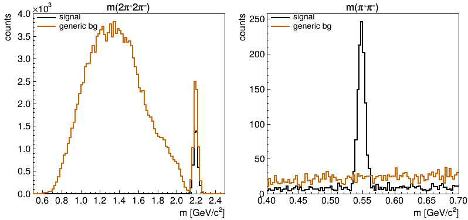
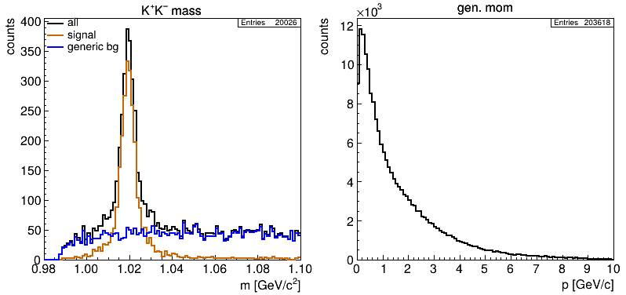

```
@@@@@@@@@@@@@@@@@@@@@@@@@@@@@@@@@@@@@@@@@@@@@@@@@@@@@@@@@@@@@@@@@@@@@@@@@@@@@@@@@@@@@@@@@@@@@@@@@@@@@@@@@
@                                                                                                       @
@    @@     @@ @@@@@@@@ @@@@@@@@     @@@@@@@@    @@@     @@@@@@  @@@@@@@@     @@@@@@  @@@@ @@     @@    @
@    @@     @@ @@       @@     @@    @@         @@ @@   @@    @@    @@       @@    @@  @@  @@@   @@@    @
@    @@     @@ @@       @@     @@    @@        @@   @@  @@          @@       @@        @@  @@@@ @@@@    @
@    @@@@@@@@@ @@@@@@   @@@@@@@@     @@@@@@   @@     @@  @@@@@@     @@        @@@@@@   @@  @@ @@@ @@    @
@    @@     @@ @@       @@           @@       @@@@@@@@@       @@    @@             @@  @@  @@     @@    @
@    @@     @@ @@       @@           @@       @@     @@ @@    @@    @@       @@    @@  @@  @@     @@    @
@    @@     @@ @@@@@@@@ @@           @@       @@     @@  @@@@@@     @@        @@@@@@  @@@@ @@     @@    @
@                                                                                                       @
@@@@@@@@@@@@@@@@@@@@@@@@@@@@@@@@@@@@@@@@@@@@@@@@@@@@@@@@@@@@@@@@@@@@@@@@@@@@@@@@@@@@@@@@@@@@@@@@@@@@@@@@@

Copyright 2025, Klaus Götzen, GSI Helmholtzzentrum für Schwerionenforschung GmbH
License: Creative Commons Attribution-NonCommercial-ShareAlike 4.0 International (CC BY-NC-SA 4.0)
```

# Table of Contents

* [Introduction](../README.md)
* [Quick Start](../README.md)
* [General Concept](GeneralConcept.md)
* [Code](Code.md)
* [Getting Started](GettingStarted.md)
* [Configuration Setup](ConfigurationSetup.md)
* [Running on Virgo](Virgo.md)
* [Tools](Tools.md)
* [Demos](Demos.md)
   + [Generator Only](#generator-only)
   + [Geometric Acceptance](#geometric-acceptance)
   + [PID Templates](#pid-templates)
   + [Secondary Vertex](#secondary-vertex)
   + [Background Study](#background-study)
   + [Using Variables](#using-variables)
   + [List Veto Selection](#list-veto-selection)
* [Appendix](Appendix.md)
* [References](References.md)

# Demos

In the folder [`cfg`](cfg) are several example configuration files addressing different aspect and possibilities to run **`HepFastSim`**. In the following some of the demos are discussed a bit more detailed.

## Generator only
[Back to TOC](#table-of-contents)

It is possible to completely skip the simulation part (acceptance cuts, efficiency, smearing, combinatorics, ...) and use `HepFastSim` only as a generator tool for decay patterns. This is demonstrated in the configuration file [`demo_gen.cfg`](../cfg/demo_gen.cfg). _(Line numbers below are for explanation only.)_
```
01: # ===== Overall options ===== 
02: OPT  ;; nmc : print=5000 : hconf=450,3 
03: 
04: # ===== Generators ===== 
05: GEN  ;; phsp : ecm=5,0.01 : reaction=anti-p-,p+ : fixtarget 
06: GEN  ;; phsp : c=1 : f=0.5 : dec = pbarpSystem -> omega pi+ pi- ; omega -> pi+ pi-  
07: GEN  ;; box  : c=2 : f=0.5 : p=1,2 : tht=22,140 : pdg=pi+- : mult=1
08: 
09: # ===== Histograms ===== 
10: HIST ;; tree=nmc : cut=chan==2 : hist=0,3,0,180 : var=p,tht*57.3 : opt=box : title=box generator;p [GeV/c];\theta [deg]
11: HIST ;; tree=nmc : cut=chan==1 : hist=0.70,0.86 : var=m[1] : divx=505 : title=generated omega mass;m(\omega) [GeV/c^{2}]
12: HIST ;; tree=nmc : cut=chan==1 && abs(m[1]-0.782)<0.3 : hist=0,26,0,26 : xp : var=m2([1]+[4]),m2([1]+[5]) : ...
13:         title=Dalitz plot;m^{2}_{\omega\pi^{+}} [GeV^{2}/c^{4}];m^{2}_{\omega\pi^{\minus}} [GeV^{2}/c^{4}] 
```
_Explanation:_
* (02) : In the line `OPT` we need to **enable the MC tree** generation by setting **`nmc`**, from which we want to generate histograms
* (05-07) : The three `GEN` statements configure **two generators**:
   + the **`phsp`** generator with a initial reaction and the decay **pbar p -> omega pi+ pi-** (channel `c=1`)
   + the **`box`** generator generating single pions (`mult=1`) with **p = 1 .. 2 GeV/c** and **theta = 22° .. 140°** (channel `c=2`)
* (10) : Histogram of **p vs theta** coverage of the box generator
* (11) : Plot **generated mass of omega(782)** from decays pbar p -> omega (-> pi+ pi-) pi+ pi-
* (12) : Show **omega pi+ pi- Dalitz plot** (the expressions for the square masses use the `HepFastSim` feature [Lorentz Expansion](ConfigurationSetup.md#lorentz-vector-expansion))


## Geometric Acceptance
[Back to TOC](#table-of-contents)

Since it is possible to setup detector spatial coverage in different ways, the file [`demo_acc.cfg`](../cfg/demo_acc.cfg) demonstrates and visualizes some possibilities.
```
01: # ===== Overall options ===== 
02: OPT  ;;  verbose=1 : hconf=500,3 : nmc : print=5000 : rndseed=123 : errlvl=3
03: 
04: # ===== Generators ===== 
05: GEN ;; box : p=2,2 : tht=0,180 : costht : pdg=pi+  : mult=1
06: 
07: # ===== Detectors ===== 
08: TRK  ;;  name = trk1 : dist=100  : wall=70,50,20,15   # forward wall center (140x100 cm with hole of 40x30cm) 
09: TRK  ;;  name = trk2 : dist=100  : wall=70,10,,,,70   # forward wall top    (140x20 cm, shifted up by 70cm)
10: TRK  ;;  name = trk3 : dist=100  : wall=70,10,,,,-70  # forward wall bottom (140x20 cm, shifted down by 70cm)
11: TRK  ;;  name = trk4 : dist=-100 : tht=140,170        # backward disc (hole for 170 deg < theta < 180 deg)
12: TRK  ;;  name = trk5 : dist=65   : tht=60,120         # barrel
13: 
14: # ===== Trees/Reco ===== 
15: REC  ;;  store(trk, ntp0) = evt,cand
16: 
17: # ===== Histograms ===== 
18: HIST ;; tree=ntp0 : hist=100,-100,100,100,-100,100 : opt=scat : msize=0.3 : cut=xmct&&xtht<1.57 : ...
19:         var=(100-xz)*tan(xtht)*cos(xphi)+xx,(100-xz)*tan(xtht)*sin(xphi)+xy : title=forward wall;x_{hit} [cm];y_{hit} [cm] 
20: HIST ;; tree=ntp0 : hist=100,-100,100,100,-100,100 : opt=scat : msize=0.3 : cut=xmct&&xtht>1.57 : ...
21:         var=(100-xz)*tan(xtht)*cos(xphi)+xx,(100-xz)*tan(xtht)*sin(xphi)+xy : title=backward disc;x_{hit} [cm];y_{hit} [cm]
22: HIST ;; tree=ntp0 : hist=90,0,180,90,-180,180      : opt=scat : msize=0.3 : var=xtht*57.3,xphi*57.3 : ...
23:         title=\theta-\phi-coverage;\theta [deg];\phi [deg]
```
_Explanation:_
* (02) : Overall options (`errlvl=3` suppresses the ROOT warning `option SCAT is deprecated`)
* (05) : Setup of a very **simple box generator** with mono-energetic single pions with **p = 2 GeV/c in full theta range**
* Define **five detector** components:
   + (08) : `trk1` = **central foward wall** of size 140x100cm **with a hole** 40x30cm at z = 100cm
   + (09) : `trk2` = **upper forward wall** of size 140x20cm **shifted up** by 70cm at z = 100cm 
   + (10) : `trk3` = **lower forward wall** of same size **shifted down** by 70cm at z = 100cm 
   + (11) : `trk4` = **backward disc** defined by angular range theta = 140° .. 170° at z = -100cm 
   + (12) : `trk5` = **barrel** parallel to z-axis defined by angular range theta = 60° .. 120° with radius r = 65cm
* (15) : Store tree with **track candidates only**
* Generate three plots:
   + (18-19) : **Hit map of all three foward walls** by computing track positions at z = 100cm from (theta, phi) 
   + (20-21) : **Hit map of backward disc** by computing particle locations at z = -100cm from (theta, phi)
   + (22-23) : **Hit map theta vs phi** (in degrees) for all detectors


## PID Templates
[Back to TOC](#table-of-contents)

Here we try and test some of the PID templates: DIRC (Detection of Internally Reflected Cherenkov light), the dE/dx and the time-of-flight. We plot the simulated quantities and the resultant total PID probabilities.
```
01: # ===== Overall options ===== 
02: OPT  ;;  rndseed=123 : verbose=1 : hconf=400,3 : pidmode=chi2 : nostat : legwid=0.1 : legmarg=0.5 : legtxt=0.05 : print=5000 : hopt=hist scat : errlvl=3
03: 
04: # ===== Generators ===== 
05: GEN  ;;  box : p=0.1,4 : tht=10,150 : pdg=pi+-, K+-, p+ cc : mult=1 
06: 
07: # ===== Trees/Reco ===== 
08: REC  ;;  store(trk,ntp0) = evt,cand
09: 
10: # ===== Detectors ===== 
11: TRK  ;;  name=trk  : tht=20,140          # Tracking detector
12: PID  ;;  name=drc  : tht=20,140 : dircb  # DIRC template (barrel)
13: PID  ;;  name=dedx : tht=20,140 : dedx   # dE/dx template (STT)
14: PID  ;;  name=tof  : tht=20,140 : tofb   # ToF template (barrel)
15: 
16: # ===== Histograms ===== 
17: HIST ;; tree=ntp0 : var=xp, xdrc  : hist=100,0,4,100,0,0.9 : cut=abs(xtrpdg)==211 : leg=\pi : legpos=br : title=DIRC;p [GeV/c];\theta_{c} [rad]
18: HIST ;; cut=abs(xtrpdg)==321 : leg=K   
19: HIST ;; cut=abs(xtrpdg)==2212 : leg=p  
20: 
21: HIST ;; tree=ntp0 : var=xp, xdedx : hist=100,0,4,100,2,20 : cut=abs(xtrpdg)==211 : leg=\pi : legpos=tr : title=dE/dx;p [GeV/c];dE/dx [keV/cm]
22: HIST ;; cut=abs(xtrpdg)==321 : leg=K  
23: HIST ;; cut=abs(xtrpdg)==2212 : leg=p 
24: 
25: HIST ;; tree=ntp0 : var=xp, xtof  : hist=100,0,4,100,0,1.2 : cut=abs(xtrpdg)==211 : leg=\pi : legpos=br : title=TOF;p [GeV/c];\beta_{TOF}
26: HIST ;; cut=abs(xtrpdg)==321 : leg=K   
27: HIST ;; cut=abs(xtrpdg)==2212 : leg=p  
28: 
29: HIST ;; tree=ntp0 : var=xpidpi : hist=0,1 : cut=abs(xtrpdg)==211 : leg=\pi : logy : title=pion PID;P_{\pi}
30: HIST ;; cut=abs(xtrpdg)!=211 : leg=non-\pi
31: 
32: HIST ;; tree=ntp0 : var=xpidk : hist=0,1 : cut=abs(xtrpdg)==321 : leg=K : logy : title=kaon PID;P_{K}
33: HIST ;; cut=abs(xtrpdg)!=321 : leg=non-K
34: 
35: HIST ;; tree=ntp0 : var=xpidp : hist=0,1 : cut=abs(xtrpdg)==2212 : leg=p : logy : title=proton PID;P_{p}
36: HIST ;; cut=abs(xtrpdg)!=2212 : leg=non-p
```
_Explanation:_
* (01) : Define general options  (`errlvl=3` suppresses the `SCAT is deprecated` output)
* (05) : Setup of a **box generator** generating **pions, kaons, protons** over large p- and theta range
* (08) : Store a TTree with the **single tracks** (no combinatorics)
* (11) : Setup **tracking detector** to cover **full phase-space** (we need detected tracks for PID information)
* (12-14) : Define **PID detectors** based on the templates **dircb** (barrel DIRC), **dedx** and **tofb** (barrel ToF)
* (17-27) : Generate histograms of **PID info (xdrc, xdedx, xtof) vs. momentum** for the three different particle species (pi, K, p)
* (29-36) : Generate histograms of **PID probability** for the three particle species


## Secondary Vertex
[Back to TOC](#table-of-contents)

Although there is no actual vertex fitting available in `HepFastSim`, a simple POCA (= point of closest approach) finder is applied for all composite candidates to find the best matching decay position. Currently this only has an effect for an assumed solenoidal field parallel to the z-axis. Also, to take effect the track propagation towards the IP must be switched on.
```
01: # ===== Overall options ===== 
02: OPT  ;;  rndseed=123 : verbose=1 : hconf=400,3 : bzfield=1.5 : prop2ip
03: 
04: # ===== Generators ===== 
05: GEN  ;;  phsp : ecm = 4.6, 0.00965 : reaction=anti-p-,p+ : fixtarget 
06: GEN  ;;  phsp : f=0.8 : c=1 : dec = beams -> pi+ pi- pi+ pi- pi0 
07: GEN  ;;  phsp : f=0.2 : c=2 : dec = beams -> K_S0 pi+ pi- pi0 ; K_S0 -> pi+ pi-
08: 
09: # ===== Detectors ===== 
10: TRK  ;;  name = trk : ptmin=0.1  : tht=20,160 : dp=2 : dtht=1 : dphi=1 : dvtx=0.05,0.05,0.15 : dist=15
11: 
12: # ===== Trees/Reco ===== 
13: REC  ;;  dec = K_S0 -> pi+ pi- : m(K_S0)=0.4,0.6 : store(K_S0, ntp0)=cand, evt
14: 
15: # ===== Histograms ===== 
16: HIST ;;  tree=ntp0 : hist=0.4,0.6 : divx=505 : title=m(\pi^{+}\pi^{\minus});m [GeV/c^{2}] : leg=all 
17: HIST ;;  cut=!xmct : leg=no match
18: HIST ;;  cut=xmct  : leg=match K_{S}
19: HIST ;;  cut=xmct  : var=fxm : leg=match K_{S} (@poca) 
20: 
21: HIST ;;  tree=ntp0 : var=xctau : hist=0,10 : logy : cut = xmct : title=c\tau(K_{S});c\tau [cm] : leg=match K_{S}
22: HIST ;;  cut=!xmct : leg=no match
23: 
24: HIST ;;  tree=ntp0 : var=xvqa : hist=0,2 : logy : title=Vertex QA : cut=xmct : leg=match K_{S}
25: HIST ;;  cut=!xmct : leg=no match
```
_Explanation:_
* (02) : In the overall options, `bzfield=1.5 : prop2ip` set the **solenoidal field to 1.5T**, and enables **track to IP propagation**
* (05-07) : Generator `phsp` is configured to generate **2pi+ 2pi+ pi0 (90%)** and **KS pi+ pi- pi0 (10%)** events
* (10) : Setup **tracking detector** with certain **vertex resolution** (`dvtx = dvx, dvy, dvz`)
* (13) : Reconstruct **KS -> pi+ pi-** and store TTree
* (16-19) : **Invariant mass** histograms of **all KS** candidate, **w/o MC match**, **w/ MC match**, and w/MC match **propagated to common POCA**. 
* (21-22) : Reconstructed **c·tau** of **matched** and **non matched** candidates; fit of exponential finds c·tau = 2.58cm
* (24-25) : Display of **vertex QA**, that is the **DOCA** (=distance of closest approach) of **track pairs** forming a KS
 


## Background Study
[Back to TOC](#table-of-contents)

The purpose of this demo is to demonstrate the use of the generic background generation with file input to the `phsp` generator. We also will analyse the generic background with the macro [`HepFastBgAnalysis.C`](Tools.md#background-analysis---hepfastbganalysisc).
```
01: # ===== Overall options ===== 
02: OPT  ;;  rndseed=1 : verbose=1 : hconf=400,3 : nostat : legwid=0.38 
03: 
04: # ===== Generators ===== 
05: GEN  ;;  phsp : ecm=2.2 : reaction=anti-p-, p+ : fixtarget 
06: GEN  ;;  phsp : f=0.02 : c=1 : dec=beams -> eta pi+ pi- ; eta -> pi+ pi-  # signal 
07: GEN  ;;  phsp : f=0.98 : file=parms/ftf_pbp.dat                           # generic BG
08: 
09: # ===== Detectors ===== 
10: TRK  ;;  name = trk : ptmin=0.1  : tht=20,160 : dp=2 : dtht=1 : dphi=1 : eff=1.0
11: 
12: # ===== Trees/Reco ===== 
13: REC  ;;  dec= eta -> pi+ pi-; beams -> eta pi+ pi- : store(beams,ntp1) = evt,cand
14: 
15: # ===== Histograms ===== 
16: HIST ;;  tree=ntp1 : var=xm : hist=0.5,2.5 : cut=chan==1 : ...
17:          title=m(2\pi^{+}2\pi^{\minus});m [GeV/c^{2}] : leg=signal
18: HIST ;;  cut=chan>1 : leg=generic bg
19: 
20: HIST ;;  tree=ntp1 : var=xd0m : hist=0.4,0.7 : cut=chan==1 && xm>2.1 : ...
21:          title=m(\pi^{+}\pi^{\minus});m [GeV/c^{2}] : leg=signal
22: HIST ;;  cut=chan>1 && xm>2.1 : leg=generic bg
```
_Explanation:_
* (02) : Overall options definition
* (05) : Simple setup of `phsp` generator with **E_cm = 3 GeV**
* (06) : Add signal channel **eta (-> pi+ pi-) pi+ pi-**
* (07) : Add **ftf_pbp.dat** as **generic background source** parameterized from [FTF generator](https://geant4.web.cern.ch/documentation/dev/prm_html/PhysicsReferenceManual/hadronic/FTFmodel/FTFmodel.html)
* (10) : Setup a simple **tracking detector**
* (13) : Combinatorics for **eta -> pi+ pi-** and **beams -> eta pi+ pi-**
* (16-18) : Histogram of **exclusive system** for the two event sources
* (20-22) : Histogram of **invariant pi+ pi- mass** for the two event sources

We run the simulation in the ROOT prompt with `HFS(100000, "cfg/demo_genbg.cfg", "savetree=ntp1:print=5000")`



In the left spectrum we see quite a number of background events peaking at the correct total center-of-mass energy, that are not removed by the cut `xm>2.1`. In the spectrum on the right they are visible as rather flat background underneath the eta signal. We can use the tool `HepFastBgAnalysis` to identify the main background channels. So first we load the macro to the ROOT prompt by `hfsb` (or `root -l HepFastBgAnalysis.C`): 
```
USAGE: HepFastBgAnalysis(TString opt=<':' separated parameter string>) or HBG(...)

  fana = <file> : input analysis file
  tree = <tree> : tree name
  fpar = <file> : file containing BG channels ('id = <num> : fs = <decay channel>')
  cut  = <cut>  : cut to be applied for analysis (e.g. window around signal)
  min  = <min>  : minimum number of counts to be printed
  coff = <coff> : channel offset
``` 
Let us try with 
```
root [0] HBG("fana=ana_demo_genbg.root : tree=ntp1 : fpar=parms/ftf_pbp.dat : cut=xm>2.1 && abs(xd0m-0.55)<0.03")

total   : 1693
id=1006 : (451)  pi- pi- pi+ pi+ 
id=1030 : (  5)  pi- pi+ eta' 
id=1616 : (  3)  K_S0 K_S0 
id=1045 : (  1)  pi- pi+ eta 
```
The main background is given (as expected) by non-resonant `2pi+ 2pi-` events. Interestingly, there are as well events with `K_S0` present. Those get even more pronounced when shifting the mass window to the nominal `K_S0` mass at m = 497 MeV, where we actually would expect a peak in the `pi+ pi-` mass. We then see three different event channels containing `K_S0`.
```
root [1]  HBG("fana=ana_demo_genbg.root : tree=ntp1 : fpar=parms/ftf_pbp.dat : cut=xm>2.1 && abs(xd0m-0.497)<0.03")
HepFastSim - Copyright (C) 2025 (GPLv3) - Author: Klaus Goetzen (GSI) - Distributed WITHOUT ANY WARRANTY.

total   : 576
id=1006 : (387)  pi- pi- pi+ pi+ 
id=1616 : ( 16)  K_S0 K_S0 
id=1106 : (  8)  K- pi+ K_S0 
id=1030 : (  6)  pi- pi+ eta' 
id=1109 : (  5)  pi- K_S0 K+ 
id=1045 : (  1)  pi- pi+ eta 
```
One can actually visualize the corresponding `K_S0` peak by plotting `ntp1->Draw("xd0m >> (100,0.4,0.7)", "xm>2.1 && chan!=1 && chan!=1006")`, removing the signal channel (`chan!=1`) and the dominant 4 pion background (`chan!=1006`).

## Using Variables
[Back to TOC](#table-of-contents)

As already being addressed in [Configuration Setup - Using Variables](ConfigurationSetup.md#using-variables) it is possible to use variables per command line, which adds much more flexibility for systematic investigations without the need to provide modified configuration files all the time.

As an example let us consider the following config-file to learn the opportunities. It is a slight variation of the above background demo.
```
01: # ===== Overall options ===== 
02: OPT  ;;  rndseed=1 : verbose=1 : hconf=400,3 : nmc : $thtrng=20,160 : $ecm=4.6 : $frac=0.1 : ...
03:          $userhist={tree=nmc : var=p : hist=0,10 : title=gen. mom;p [GeV/c]} : $bgopt= : $mhist=0.98,1.1 : $cut=
04: 
05: # ===== Generators ===== 
06: GEN  ;;  phsp : ecm=$ecm : reaction=anti-p-, p+ : fixtarget
07: GEN  ;;  phsp : f=$frac : c=1    : dec=beams -> phi pi+ pi- ; phi -> K+ K- # signal 
08: GEN  ;;  phsp : f=0.2   : c=1000 : file=parms/ftf_pbp.dat : $bgopt         # generic BG
09: 
10: # ===== Detectors ===== 
11: TRK  ;;  name = trk : ptmin=0.1 : tht=$thtrng : dp=2 : dtht=1 : dphi=1 : eff=1.0
12: 
13: # ===== Trees/Reco ===== 
14: REC  ;;  store(trk,ntp0) = evt,cand
15: REC  ;;  dec= phi -> K+ K- : store(phi,ntp1) = evt,cand
16: 
17: # ===== Histograms ===== 
18: HIST ;;  tree=ntp1 : hist=$mhist : title=K^{+}K^{\minus} mass;m [GeV/c^{2}] : leg=all : cut=$cut
19: HIST ;;  cut=chan==1   : leg=signal
20: HIST ;;  cut=chan>999 : leg=generic bg
21: 
22: HIST ;;  $userhist
```
_Explanation:_
* (02-03) : Options and variables definition; we **set default values for variables** (`$thtrng, $ecm, $frac, $userhist, $bgopt, $mhist, $cut`).
* (06-08) : Generator setup; here **`$ecm` (energy), `$frac` (signal fractions) and `$bgopt` (options for generic events)** can be modified
* (11) : Tracking detector; we want to control the polar angle coverage by `$thtrng`
* (23) : A complete histogram can be defined via command line.

Running the simulation without additional options with `HFS(20000, "cfg/demo_var.cfg")` gives this effective config-file and plot as output:
```
[...]
GEN  ;;  phsp : ecm=4.6 : reaction=anti-p-, p+ : fixtarget
GEN  ;;  phsp : f=0.1 : c=1    : dec=beams -> phi pi+ pi- ; phi -> K+ K-
GEN  ;;  phsp : f=0.2   : c=1000 : file=parms/ftf_pbp.dat : 
TRK  ;;  name = trk : ptmin=0.1 : tht=20,160 : dp=2 : dtht=1 : dphi=1 : eff=1.0
[...]
HIST ;;  tree=ntp1 : hist=0.98,1.1 : title=K^{+}K^{\minus} mass;m [GeV/c^{2}] : leg=all : cut=1
HIST ;;  cut=chan==1  && 1 : leg=signal
HIST ;;  cut=chan>999 && 1 : leg=generic bg
HIST ;;  tree=nmc : var=p : hist=0,10 : title=gen. mom;p [GeV/c]
```


When calling as
```
root [1] HFS(20000, "cfg/demo_var.cfg", "$ecm=5 : $thtrng=10,80 : $bgopt=trig=K_S0 : $frac=0.2 : $mhist=150,0.97,1.15 :"
            "$userhist={tree=ntp0 : var=xtht*57.3 : hist=0,90 : title=rec. \\theta;\\theta [deg]} : $cut=xd0p<1.5")
```
we get
```
 [...]
GEN  ;;  phsp : ecm=5 : reaction=anti-p-, p+ : fixtarget
GEN  ;;  phsp : f=0.2 : c=1    : dec=beams -> phi pi+ pi- ; phi -> K+ K-
GEN  ;;  phsp : f=0.2   : c=1000 : file=parms/ftf_pbp.dat : trig=K_S0
TRK  ;;  name = trk : ptmin=0.1 : tht=10,80 : dp=2 : dtht=1 : dphi=1 : eff=1.0
[...]
HIST ;;  tree=ntp1 : hist=150,0.97,1.15 : title=K^{+}K^{\minus} mass;m [GeV/c^{2}] : leg=all : cut=xd0p<1.5
HIST ;;  cut=chan==1  && xd0p<1.5 : leg=signal
HIST ;;  cut=chan>999 && xd0p<1.5 : leg=generic bg
HIST ;;  tree=ntp0 : var=xtht*57.3 : hist=0,90 : title=rec. \theta;\theta [deg]
```


## List Veto Selection
[Back to TOC](#table-of-contents)

As described in the section [Configuration Setup - REC - Selection](ConfigurationSetup.md#selection) it is possible to apply so-called list veto selection. This means, that particles appearing as in a certain list are rejected from another list. A classical example is a pi0 veto for the reconstruction of the decay eta -> gamma gamma. The following file shows an example.
```
01: # ===== Overall options ===== 
02: OPT  ;;  nmc=1 : rndseed=123 : verbose=1 : hconf=350,4 : legtxt=0.05 
03: 
04: # ===== Generators ===== 
05: GEN  ;;  phsp : ecm=4.6, 0.00965 : reaction=anti-p-,p+ : fixtarget 
06: GEN  ;;  phsp : f=0.1 : c=1 : dec=beams -> eta pi+ pi-; eta -> gamma gamma  # signal
07: GEN  ;;  phsp : f=0.5 : file=parms/ftf_pbp.dat                              # generic bg
08: 
09: # ===== Detectors ===== 
10: INC  ;;  cfg/det_panda.cfg
11: 
12: # ===== Trees/Reco ===== 
13: REC  ;;  dec= pi0 -> gamma gamma :                  : store(pi0,ntp0) = evt,cand 
14: REC  ;;  dec= pi0 -> gamma gamma : m(pi0)=0.11,0.16 : store(pi0,ntp1) = evt,cand 
15: REC  ;;  dec= eta -> gamma gamma :                  : store(eta,ntp2) = evt,cand
16: REC  ;;  dec= eta -> gamma gamma : veto(eta)=pi0    : store(eta,ntp3) = evt,cand
17: REC  ;;  dec= eta -> gamma gamma : !veto(eta)=pi0   : store(eta,ntp4) = evt,cand
18: 
19: # ===== Histograms ===== 
20: HIST ;;  tree=ntp2 : leg=raw    : hist=0.0,0.8 : divx=505 : legpos=tr : nostat : ...
21:          title=full \gamma\gamma mass;m(\gamma\gamma) [GeV/c^{2}]
22: HIST ;;  tree=ntp1 : leg=veto   : hist=0.0,0.8  : opt=same
23: HIST ;;  tree=ntp3 : leg=select : hist=0.0,0.8  : opt=same
24: 
25: HIST ;;  tree=ntp0 : hist=0.0,0.25 : leg=raw : divx=505 : ...
26:          title=\pi^{0} candidates;m(\gamma\gamma) [GeV/c^{2}]
27: HIST ;;  tree=ntp1 : hist=0.0,0.25 : leg=veto : opt=same
28: 
29: HIST ;;  tree=ntp2 : leg=raw    : hist=0.3,0.8 : divx=505 : legpos=tr : nostat : ...
30:          title=\eta candidates;m(\gamma\gamma) [GeV/c^{2}]
31: HIST ;;  tree=ntp3 : leg=select : hist=0.3,0.8  : opt=same : color=4
32: HIST ;;  tree=ntp4 : leg=reject : hist=0.3,0.8  : opt=same : color=2
```
_Explanation:_
* (02) : Overall options
* (05-07) : Setting up generator with **signal eta -> gamma gamma** and **generic background**
* (10) : Use PANDA detector setup for reconstruction
* (13) : Reconstruct **pi0 -> gamma gamma raw** spectrum
* (14) : Reconstruct **pi0 -> gamma gamma with mass cut** for applying **veto**
* (15) : Reconstruct **eta -> gamma gamma raw** spectrum for comparison
* (16) : Reconstruct **eta -> gamma gamma with veto selection** 
* (17) : Reconstruct **eta -> gamma gamma with anti-veto selection** 
* (20-23) : Histogram of 2-gamma mass in **full mass region** showing raw spectrum, veto cut and selected candidates
* (25-27) : Histogram of 2-gamma mass in **pi0 mass region** showing full spectrum and veto cut
* (29-32) : Histogram of 2-gamma mass in **eta mass region** with **background suppression by pi0 veto**
  


Proceed to the next section: [Appendix](Appendix.md)
