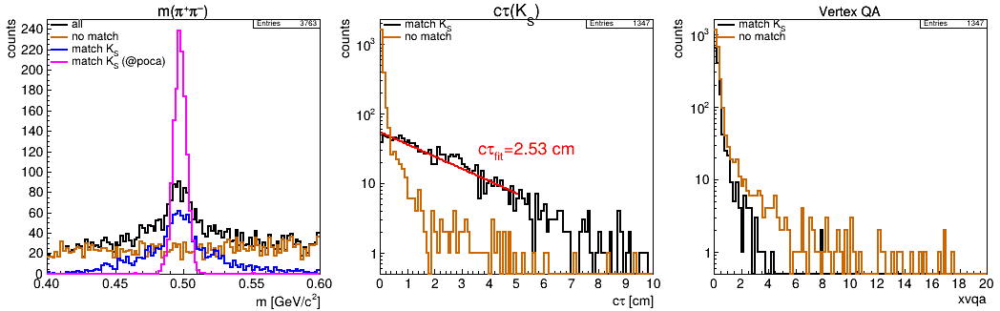

```
@@@@@@@@@@@@@@@@@@@@@@@@@@@@@@@@@@@@@@@@@@@@@@@@@@@@@@@@@@@@@@@@@@@@@@@@@@@@@@@@@@@@@@@@@@@@@@@@@@@@@@@@@
@                                                                                                       @
@    @@     @@ @@@@@@@@ @@@@@@@@     @@@@@@@@    @@@     @@@@@@  @@@@@@@@     @@@@@@  @@@@ @@     @@    @
@    @@     @@ @@       @@     @@    @@         @@ @@   @@    @@    @@       @@    @@  @@  @@@   @@@    @
@    @@     @@ @@       @@     @@    @@        @@   @@  @@          @@       @@        @@  @@@@ @@@@    @
@    @@@@@@@@@ @@@@@@   @@@@@@@@     @@@@@@   @@     @@  @@@@@@     @@        @@@@@@   @@  @@ @@@ @@    @
@    @@     @@ @@       @@           @@       @@@@@@@@@       @@    @@             @@  @@  @@     @@    @
@    @@     @@ @@       @@           @@       @@     @@ @@    @@    @@       @@    @@  @@  @@     @@    @
@    @@     @@ @@@@@@@@ @@           @@       @@     @@  @@@@@@     @@        @@@@@@  @@@@ @@     @@    @
@                                                                                                       @
@@@@@@@@@@@@@@@@@@@@@@@@@@@@@@@@@@@@@@@@@@@@@@@@@@@@@@@@@@@@@@@@@@@@@@@@@@@@@@@@@@@@@@@@@@@@@@@@@@@@@@@@@
```

# Table of Contents

* [Introduction](../README.md)
* [Quick Start](../README.md)
* [General Concept](GeneralConcept.md)
* [Code](Code.md)
* [Getting Started](GettingStarted.md)
* [Configuration Setup](ConfigurationSetup.md)
* [Running on Virgo](Virgo.md)
* [Tools](Tools.md)
* [Demos](Demos.md)
   + [Generator Only](#generator-only)
   + [Geometric Acceptance](#geometric-acceptance)
   + [PID Templates](#pid-templates)
   + [Secondary Vertex](#secondary-vertex)
   + [Background Study](#background-study)
* [Appendix](Appendix.md)

# Demos

In the folder [`cfg`](cfg) are several example configuration files addressing different aspect and possibilities to run **`HepFastSim`**. In the following some of the demos are discussed a bit more detailed.

## Generator only
[Back to TOC](#table-of-contents)

It is possible to completely skip the simulation part (acceptance cuts, efficiency, smearing, combinatorics, ...) and use `HepFastSim` only as a generator tool for decay patterns. This is demonstrated in the configuration file [`cfg/demo_gen.cfg`](cfg/demo_gen.cfg).
```
OPT  ;; nmc : print=5000 : hconf=450,3

GEN  ;; phsp : ecm=5,0.01 : reaction=anti-p-,p+ : fixtarget 
GEN  ;; phsp : c=1 : f=0.5 : dec = pbarpSystem -> omega pi+ pi- ; omega -> pi+ pi-  
GEN  ;; box  : c=2 : f=0.5 : p=1,2 : tht=22,140 : pdg=pi+- : mult=1

# simple p vs theta plot from box generator (chan==2)
HIST ;; tree=nmc : cut=chan==2 : hist=0,3,0,180 : var=p,tht*57.3 : opt=box : title=box generator;p [GeV/c];\theta [deg]

# generated omega mass from ppbar -> omega (-> pi+ pi-) pi+ pi-
HIST ;; tree=nmc : cut=chan==1 : hist=0.70,0.86 : var=m[1] : divx=505 : title=generated omega mass;m(\omega) [GeV/c^{2}]

# Dalitz plot of omega pi+ pi- (the needed masses can be computed from the 4-vector informations)
HIST ;; tree=nmc : cut=chan==1&&abs(m[1]-0.782)<0.3 : hist=0,26,0,26 : ...
        var=((e[1]+e[4])^2-(px[1]+px[4])^2-(py[1]+py[4])^2-(pz[1]+pz[4])^2),((e[1]+e[5])^2-(px[1]+px[5])^2-(py[1]+py[5])^2-(pz[1]+pz[5])^2) : ...
        title=Dalitz plot;m^{2}_{\omega\pi^{+}} [GeV^{2}/c^{4}];m^{2}_{\omega\pi^{\minus}} [GeV^{2}/c^{4}] 
```
_Explanation:_
* In the line `OPT` we need to **enable the MC tree** generation by setting **`nmc`**, from which we want to generate histograms
* The three `GEN` statements configure **two generators**:
   + the **`phsp`** generator with a initial reaction and the decay **pbar p -> omega pi+ pi-** (channel `c=1`)
   + the **`box`** generator generating single pions (`mult=1`) with **p = 1 .. 2 GeV/c** and **theta = 22° .. 140°** (channel `c=2`)
* Three histograms are created:
   + **p vs theta** coverage of the box generator
   + the **generated mass of omega(782)** from decays pbar p -> omega (-> pi+ pi-) pi+ pi-
   + the **omega pi+ pi- Dalitz plot** (the expressions for the square masses need to be computed from the 4-vectors)


## Geometric Acceptance
[Back to TOC](#table-of-contents)

Since it is possible to setup detector spatial coverage in different ways, the file `cfg/demo_acc.cfg` demonstrates and visualizes some possibilities.
```
# ----- generator ------
GEN ;; box : p=2,2 : tht=0,180 : costht : pdg=pi+  : mult=1

# ----- detectors ------
TRK  ;;  name = trk1 : dist=100  : wall=70,50,20,15   # forward wall center (140x100 cm with hole of 40x30cm) 
TRK  ;;  name = trk2 : dist=100  : wall=70,10,,,,70   # forward wall top    (140x20 cm, shifted up by 70cm)
TRK  ;;  name = trk3 : dist=100  : wall=70,10,,,,-70  # forward wall bottom (140x20 cm, shifted down by 70cm)
TRK  ;;  name = trk4 : dist=-100 : tht=140,170        # backward disc (hole for 170 deg < theta < 180 deg)
TRK  ;;  name = trk5 : dist=65   : tht=60,120         # barrel

# ----- reconstruction ------
REC  ;;  store(trk, ntp0) = evt,cand

# ----- plots ------
HIST ;; tree=ntp0 : hist=100,-100,100,100,-100,100 : opt=box : cut=xmct&&xtht<1.57 : var=(100-xz)*tan(xtht)*cos(xphi)+xx,(100-xz)*tan(xtht)*sin(xphi)+xy : title=forward wall;x_{hit} [cm];y_{hit} [cm] 
HIST ;; tree=ntp0 : hist=100,-100,100,100,-100,100 : opt=box : cut=xmct&&xtht>1.57 : var=(100-xz)*tan(xtht)*cos(xphi)+xx,(100-xz)*tan(xtht)*sin(xphi)+xy : title=backward disc;x_{hit} [cm];y_{hit} [cm]
HIST ;; tree=ntp0 : hist=90,0,180,90,-180,180      : opt=box : var=xtht*57.3,xphi*57.3 : title=\theta-\phi-coverage;\theta [deg];\phi [deg]
```
_Explanation:_
* Setup of a very **simple box generator** with mono-energetic single pions with **p = 2 GeV/c in full theta range**
* Define **five detector** components:
   + `trk1`: **central foward wall** of size 140x100cm **with a hole** 40x30cm at z = 100cm
   + `trk2`: **upper forward wall** of size 140x20cm **shifted up** by 70cm at z = 100cm 
   + `trk3`: **lower forward wall** of same size **shifted down** by 70cm at z = 100cm 
   + `trk4`: **backward disc** defined by angular range theta = 140° .. 170° at z = -100cm 
   + `trk5`: **barrel** parallel to z-axis defined by angular range theta = 60° .. 120° with radius r = 65cm
* Store tree with **tracks candidates only**
* Generate three plots:
   + Hit map of **all three foward walls** by computing track positions at z = 100cm from theta, phi 
   + Hit map of **backward disc** by computing track positions at z = -100cm from theta, phi
   + Hit map **theta vs phi** for all detectors


## PID Templates
[Back to TOC](#table-of-contents)

Here we try and test some of the PID templates: DIRC (Detection of Internally Reflected Cherenkov light), the dE/dx and the time-of-flight. We plot the simulated quantities and the resultant total PID probabilities (line numbers below are for explanation only).
```
01: # ===== Overall options ===== 
02: OPT  ;;  rndseed=123 : verbose=1 : hconf=400,3 : pidmode=chi2 : nostat : legwid=0.1 : legmarg=0.5 : legtxt=0.05 : print=5000 : hopt=hist scat : errlvl=3
03: 
04: # ===== Generators ===== 
05: GEN  ;;  box : p=0.1,4 : tht=10,150 : pdg=pi+-, K+-, p+ cc : mult=1 
06: 
07: # ===== Trees/Reco ===== 
08: REC  ;;  store(trk,ntp0) = evt,cand
09: 
10: # ===== Detectors ===== 
11: TRK  ;;  name=trk  : tht=20,140          # Tracking detector
12: PID  ;;  name=drc  : tht=20,140 : dircb  # DIRC template (barrel)
13: PID  ;;  name=dedx : tht=20,140 : dedx   # dE/dx template (STT)
14: PID  ;;  name=tof  : tht=20,140 : tofb   # ToF template (barrel)
15: 
16: # ===== Histograms ===== 
17: HIST ;; tree=ntp0 : var=xp, xdrc  : hist=100,0,4,100,0,0.9 : cut=abs(xtrpdg)==211 : leg=\pi : legpos=br : title=DIRC;p [GeV/c];\theta_{c} [rad]
18: HIST ;; cut=abs(xtrpdg)==321 : leg=K   
19: HIST ;; cut=abs(xtrpdg)==2212 : leg=p  
20: 
21: HIST ;; tree=ntp0 : var=xp, xdedx : hist=100,0,4,100,2,20 : cut=abs(xtrpdg)==211 : leg=\pi : legpos=tr : title=dE/dx;p [GeV/c];dE/dx [keV/cm]
22: HIST ;; cut=abs(xtrpdg)==321 : leg=K  
23: HIST ;; cut=abs(xtrpdg)==2212 : leg=p 
24: 
25: HIST ;; tree=ntp0 : var=xp, xtof  : hist=100,0,4,100,0,1.2 : cut=abs(xtrpdg)==211 : leg=\pi : legpos=br : title=TOF;p [GeV/c];\beta_{TOF}
26: HIST ;; cut=abs(xtrpdg)==321 : leg=K   
27: HIST ;; cut=abs(xtrpdg)==2212 : leg=p  
28: 
29: HIST ;; tree=ntp0 : var=xpidpi : hist=0,1 : cut=abs(xtrpdg)==211 : leg=\pi : logy : title=pion PID;P_{\pi}
30: HIST ;; cut=abs(xtrpdg)!=211 : leg=non-\pi
31: 
32: HIST ;; tree=ntp0 : var=xpidk : hist=0,1 : cut=abs(xtrpdg)==321 : leg=K : logy : title=kaon PID;P_{K}
33: HIST ;; cut=abs(xtrpdg)!=321 : leg=non-K
34: 
35: HIST ;; tree=ntp0 : var=xpidp : hist=0,1 : cut=abs(xtrpdg)==2212 : leg=p : logy : title=proton PID;P_{p}
36: HIST ;; cut=abs(xtrpdg)!=2212 : leg=non-p
```
_Explanation:_
* (01) : Define general options  (`errlvl=3` suppresses the `SCAT is deprecated` output)
* (05) : Setup of a **box generator** generating **pions, kaons, protons** over large p- and theta range
* (08) : Store a TTree with the **single tracks** (no combinatorics)
* (11) : Setup **tracking detector** to cover **full phase-space** (we need detected tracks for PID information)
* (12-14) : Define **PID detectors** based on the templates **dircb** (barrel DIRC), **dedx** and **tofb** (barrel ToF)
* (17-27) : Generate histograms of **PID info (xdrc, xdedx, xtof) vs. momentum** for the three different particle species (pi, K, p)
* (29-36) : Generate histograms of **PID probability** for the three particle species


## Secondary Vertex
[Back to TOC](#table-of-contents)

Although there is no actual vertex fitting available in `HepFastSim`, a simple POCA (= point of closest approach) finder is applied for all composite candidates to find the best matching decay position. Currently this only has an effect for an assumed solenoidal field parallel to the z-axis. Also, to take effect the track propagation towards the IP must be switched on.
```
01: # ===== Overall options ===== 
02: OPT  ;;  rndseed=123 : verbose=1 : hconf=400,3 : bzfield=1.5 : prop2ip
03: 
04: # ===== Generators ===== 
05: GEN  ;;  phsp : ecm = 4.6, 0.00965 : reaction=anti-p-,p+ : fixtarget 
06: GEN  ;;  phsp : f=0.9 : c=1 : dec = beams -> pi+ pi- pi+ pi- pi0 
07: GEN  ;;  phsp : f=0.1 : c=2 : dec = beams -> K_S0 pi+ pi- pi0 ; K_S0 -> pi+ pi-
08: 
09: # ===== Detectors ===== 
10: TRK  ;;  name = trk : ptmin=0.1  : tht=20,160 : dp=2 : dtht=1 : dphi=1 : dvtx=0.50,0.50,0.80 : dist=15
11: 
12: # ===== Trees/Reco ===== 
13: REC  ;;  dec = K_S0 -> pi+ pi- : m(K_S0)=0.4,0.6 : store(K_S0, ntp0)=cand, evt
14: 
15: # ===== Histograms ===== 
16: HIST ;;  tree=ntp0 : hist=0.4,0.6 : divx=505 : title=m(\pi^{+}\pi^{\minus});m [GeV/c^{2}] : leg=all 
17: HIST ;;  cut=!xmct : leg=no match
18: HIST ;;  cut=xmct  : leg=match K_{S}
19: HIST ;;  cut=xmct  : var=fxm : leg=match K_{S} (@poca) 
20: 
21: HIST ;;  tree=ntp0 : var=xctau : hist=0,10 : logy : cut = xmct : title=c\tau(K_{S});c\tau [cm] : leg=match K_{S}
22: HIST ;;  cut=!xmct : leg=no match
23: 
24: HIST ;;  tree=ntp0 : var=xvqa : hist=0,2 : logy : title=Vertex QA : cut=xmct : leg=match K_{S}
25: HIST ;;  cut=!xmct : leg=no match
```
_Explanation:_
* (02) : In the overall options, `bzfield=1.5 : prop2ip` set the **solenoidal field to 1.5T**, and enables **track to IP propagation**
* (05-07) : Generator `phsp` is configured to generate **2pi+ 2pi+ pi0 (90%)** and **KS pi+ pi- pi0 (10%)** events
* (10) : Setup **tracking detector** with certain **vertex resolution** (`dvtx = dvx, dvy, dvz`)
* (13) : Reconstruct **KS -> pi+ pi-** and store TTree
* (16-19) : **Invariant mass** histograms of **all KS** candidate, **w/o MC match**, **w/ MC match**, and w/MC match **propagated to common POCA**. 
* (21-22) : Reconstructed **c·tau** of **matched** and **non matched** candidates; fit of exponential finds c·tau = 2.58cm
* (24-25) : Display of **vertex QA**, that is the **DOCA** (=distance of closest approach) of **track pairs** forming a KS
 


## Background Study
[Back to TOC](#table-of-contents)

The purpose of this demo is to demonstrate the use of the generic background generation with file input to the `phsp` generator. 
```
01: # ===== Overall options ===== 
02: OPT  ;;  rndseed=1 : verbose=1 : hconf=400,2 : nostat : legwid=0.38
03: 
04: # ===== Generators ===== 
05: GEN  ;;  phsp : ecm=3.0 
06: GEN  ;;  phsp : f=0.2 : c=1 : dec=beams -> phi pi+ pi- ; phi -> K+ K-  # signal 
07: GEN  ;;  phsp : f=0.6 : file=parms/dpm.dat                             # generic BG
08: GEN  ;;  phsp : f=0.2 : c=10000 : file=parms/dpm.dat : trig=K_S0       # generic BG
09: 
10: # ===== Detectors ===== 
11: TRK  ;;  name = trk : ptmin=0.1  : tht=20,160 : dp=2 : dtht=1 : dphi=1 : eff=1.0
12: 
13: # ===== Trees/Reco ===== 
14: REC  ;;  store(trk,ntp0) = evt,cand
15: REC  ;;  dec= phi -> K+ K- : store(phi,ntp1) = evt,cand
16: 
17: # ===== Histograms ===== 
18: HIST ;;  tree=ntp0 : var=xp : hist=0,1.5 : title=momenta;p [GeV/c] : leg=all : legpos=tr
19: HIST ;;  cut=chan==1 : leg=signal
20: HIST ;;  cut=chan>1 && chan<9999 : leg=generic bg
21: HIST ;;  cut=chan>9999 : leg=generic (trig K\lower[0.4]{\scale[0.7]{S}})
22: 
23: HIST ;;  tree=ntp1 : hist=0.98,1.1 : title=K^{+}K^{\minus} mass;m [GeV/c^{2}] : leg=all : legpos=tr
24: HIST ;;  cut=chan==1 : leg=signal
25: HIST ;;  cut=chan>1 && chan<9999 : leg=generic bg
26: HIST ;;  cut=chan>9999 : leg=generic (trig K\lower[0.4]{\scale[0.7]{S}})
```
_Explanation:_
* (02) : Overall options definition
* (05) : Simple setup of `phsp` generator with **E_cm = 3 GeV**
* (06) : Add signal channel **phi (-> K+ K-) pi+ pi-**
* (07) : Add **dpm.dat** as **generic background source** based on DPM (Dual Parton Model) generator
* (08) : Add another **generic background source**, but this time trigger on channels **comprising a K_S**
* (11) : Setup a simple **tracking detector**
* (14) : Store **individual tracks** (for momentum spectrum)
* (15) : Combinatorics for **phi -> K+ K-**
* (18-21) : Histogram of **track momenta** for the three event sources
* (23-26) : Histogram of **invariant K+ K- masses** for the three event sources; the bump around 1.07 GeV/c^2 is generated by pi-K mismatch from K_S decays


